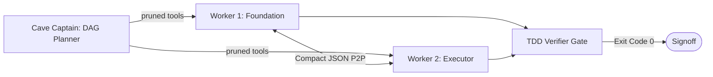

# CaveAgents ⚡

[](LICENSE)
[](https://github.com/sanad-source/cave-agents)
[](docs/BENCHMARKS.md)
[](docs/BENCHMARKS.md)
[](https://github.com/sanad-source/cave-agents/actions/workflows/ci.yml)

> **Autonomous multi-agent engineering teams with minimal token overhead.**  
> Slashes multi-agent coordination costs by **-81.3%** vs standard teamwork via dynamic tool pruning, strict file scoping, and compact peer-to-peer wire messaging.

---

## ⚡ Empirical Findings at a Glance

Multi-agent teams expend **2.35x to 13.62x more tokens** than an identical pruned single agent. CaveAgents slashes multi-agent coordination cost down to its lower bound, but optimized single agents remain structurally cheaper across tested scales:

| Benchmark Tier | Control (Pruned Single Agent) | Team (CaveAgents) | Coordination Tax | Latency (Wall-Clock) | Hidden Pass Rate |
| :--- | :---: | :---: | :---: | :---: | :---: |
| **Tier 1: Rate Limiter** (91 LOC, $n=1$) | **11,381** tokens | **26,784** tokens (v4, 3 agents) | **2.35x** (-81.3% vs Teamwork) | Sequential handoff | 7/7 vs 7/7 (Tie) |
| **Tier 2: Async Service** (~500 LOC, $n=10$) | **27,824 ± 5,440** | **85,782 ± 11,462** (v4-lite, 2 agents) | **3.08x** (+208.3%) | 153.8s vs 155.5s (1.01x) | 99.4% vs 100% (Noise) |

### Key Takeaways
1. **Multi-Agent Optimization**: CaveAgents v4 drops 3-agent TDD costs from **143.2k** (Standard Teamwork) to **26.8k tokens** (-81.3%).
2. **The Coordination Tax**: Even the cheapest possible team shape—2 workers, serial handoff, no review gate (`v4-lite`)—costs **3.08x tokens** over a pruned single agent.
3. **Latency Parity is Functional Serialization**: Wall-clock time was a wash (155.5s vs 153.8s). Upstream data dependencies blocked execution: the Executor subagent spent 38 turns polling while waiting for Foundation models.
4. **Quality Parity**: The 160/160 vs 159/160 pass rate was a single timeout cancellation failure in Monolith Trial 08, not a systematic quality advantage.

---

## 📊 Benchmark Evidence

### Tier 1: Single Algorithmic Component (`TokenBucket`, 91 LOC)

| Architecture | Estimated Tokens | Multiple vs Control | Topology & Registry | Hidden Tests (7 Tests) |
| :--- | :---: | :---: | :--- | :---: |
| **Pruned Mono (Control)** | **11,381** | **1.00x** (Baseline) | 1 Agent, 5 Pruned Tools | **7/7 (100%)** |
| **Caveman Mono** | **16,285** | 1.43x | 1 Agent, 16 Tools (Terse prompt) | **7/7 (100%)** |
| **CaveAgents v4** | **26,784** | 2.35x | 3-Agent Team, 5 Pruned Tools | **7/7 (100%)** |
| Standard Mono | 30,241 | 2.66x | 1 Agent, 16 Tools (Verbose prompt) | — |
| CaveAgents v3 | 50,395 | 4.43x | 3-Agent Team, 16 Tools | — |
| CaveAgents v2 | 91,432 | 8.03x | 3-Agent Team, 16 Tools | — |
| CaveAgents v1 | 109,984 | 9.66x | 3-Agent Team, 16 Tools | — |
| Standard Teamwork (Live) | 143,219 | 12.58x | 3-Agent Team, 16 Tools | 5/7 (Failed 2) |
| AgentTeams | 154,998 | 13.62x | 3-Agent Team, 16 Tools | — |

<p align="center">
  
</p>

### Tier 2: Multi-File Asynchronous Service (`taskflow`, $N=20$, $n=10$ per Arm)

| Architecture ($n=10$) | Mean Tokens ± SD | Median Tokens | Wall-Clock Latency | Hidden Adversarial Pass Rate | Flawless Runs |
| :--- | :---: | :---: | :---: | :---: | :---: |
| **Pruned Monolith Control** | **27,824 ± 5,440** | 25,447 | **153.8s ± 30.6s** | 159 / 160 (99.38%) | 9 / 10 |
| **CaveAgents v4-lite (2-Worker, No Review)** | **85,782 ± 11,462** | 81,602 | **155.5s ± 29.2s** | **160 / 160 (100.00%)** | 10 / 10 |

<p align="center">
  
</p>
<p align="center">
  
</p>

*Complete trial logs, per-turn schema breakdowns, and raw transcript GUIDs: [docs/BENCHMARKS.md](docs/BENCHMARKS.md).*

---

## 🏛️ Architecture



### Core Mechanisms
- **Dynamic Tool Registry Pruning**: `define_subagent` registers only 5 core tools (~380 tokens/turn vs ~2,480 for 16 tools), saving ~2,100 tokens per turn.
- **Direct P2P Wire Messaging**: Subagents coordinate directly via compact JSON payloads without supervisor relay bloat.
- **Pre-Flight Scoping (`inScope`)**: Static AST analysis bounds workers to exact files, eliminating blind exploration.
- **Automated TDD Gates**: Short-circuit test verification (`pytest -q --tb=short`) guarantees code integrity before signoff.

*Full architectural specification: [docs/ARCHITECTURE.md](docs/ARCHITECTURE.md).*

---

## 🚀 Quickstart

### Install
```bash
git clone https://github.com/sanad-source/cave-agents.git
cd cave-agents && pip install -e .
```

### CLI
```bash
caveagents benchmarks               # Display empirical benchmark table
caveagents evaluate transcript.json  # Compute token usage from raw JSONL
caveagents validate "TASK: Refactor queue.py. Run pytest." # Test terseness
```

### Python SDK
```python
from caveagents import format_cave_message, CostEvaluator

# Compact wire protocol
msg = format_cave_message("foundation", "executor", "SYNC", {"ready": True})

# Benchmark cost evaluation
print(CostEvaluator().compare_benchmarks(26784))
```

### Install as Skill
```bash
mkdir -p ~/.gemini/antigravity/skills
cp -r skills/caveagents ~/.gemini/antigravity/skills/
```
In any session prompt: `Activate CaveAgents v4 mode.`

### Standalone System Prompt
To use CaveAgents v4 with **DeepSeek**, **Claude**, or **ChatGPT**, paste [**PROMPT.md**](PROMPT.md) into the model's system prompt or custom instructions.

---

## 🔬 Limitations & Methodology

- **Offline Step Accounting**: Tokens combine dialogue (`tiktoken cl100k_base`) + fixed tool schema constants. Live API billing with prefix caching would likely narrow the 3.08x gap because offline parsing under-counts the monolith's cumulative re-sent context across 35 turns.
- **Prompt Caching Economics**: Tool schema pruning saves un-cached tokens on paper; dollar savings depend on provider prefix cache hit rates (~75–80%).
- **Untested Team Mechanisms**: Neither true parallel speedup (requires zero-dependency subtasks) nor review defect filtering (requires dedicated review stage + mutation suite) was exercised on Tier 2.

*Full methodological deep-dive: [docs/BENCHMARKS.md](docs/BENCHMARKS.md#limitations--threats-to-validity).*

---

## 🗺️ Research Roadmap

- [x] **Pruned Monolith Control**: 11,381 tokens (2.35x cheaper than v4 team).
- [x] **Statistical Power ($n=10$) & Tier 2 Benchmark**: 27.8k vs 85.8k tokens (3.08x tax) at latency parity.
- [ ] **Empirical Test of Parallelism**: Benchmark decoupled modules with zero file dependencies to test true concurrent speedup.
- [ ] **Empirical Test of Review Efficacy**: 3-agent team (`Foundation` + `Executor` + `Reviewer`) against mutation test harness.
- [ ] **Native API Billing Telemetry**: Live provider headers for exact cache-hit dollar accounting.

---

## 🙏 Credits

- **Caveman Mode**: Created by [Julius Brussee](https://github.com/JuliusBrussee/caveman) (*"why use many token when few token do trick"*).
- **AgentTeams**: Inspired by [dsh-agent-teams](https://github.com/NanmiCoder/dsh-agent-teams).
