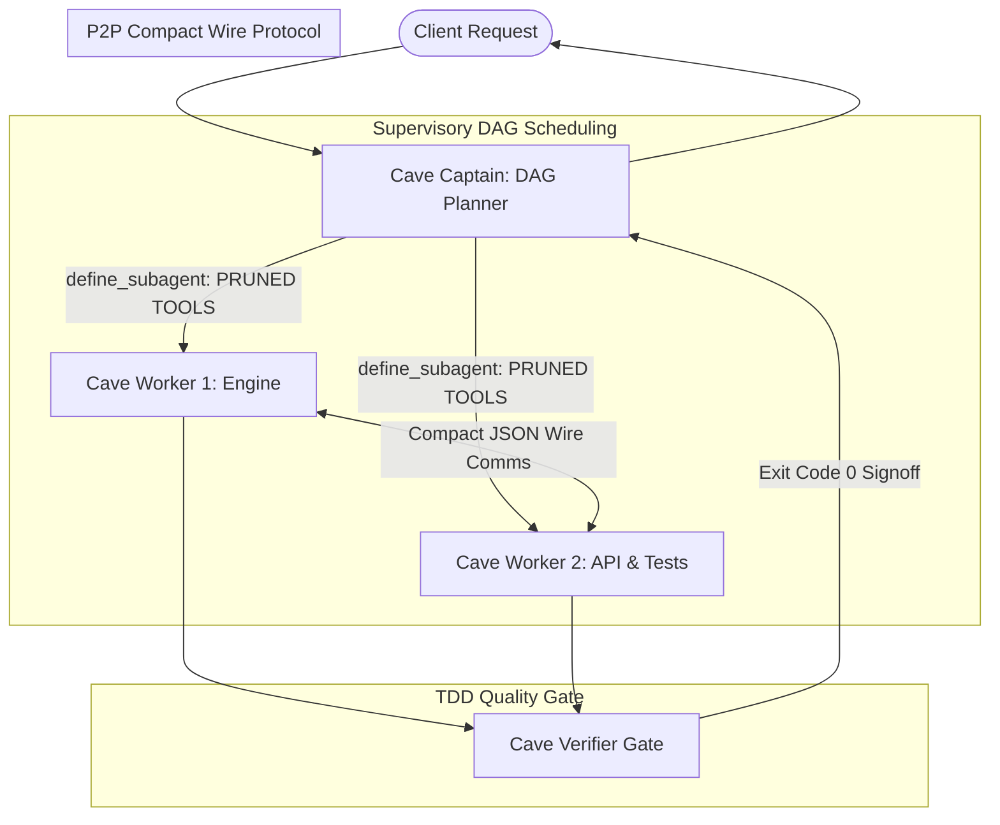

# CaveAgents ⚡

[](LICENSE)
[](https://github.com/sanad-source/cave-agents)
[-f97316.svg)](docs/BENCHMARKS.md)
[](docs/BENCHMARKS.md)  
[](https://github.com/NanmiCoder/dsh-agent-teams)
[](https://github.com/JuliusBrussee/caveman)
[](tests/)

## 📋 Summary

Multi-agent software engineering workflows typically incur an 80%–85% token penalty compared to single-agent execution. This overhead is driven by redundant tool schema re-injection on every turn, conversational pleasantries, and multi-agent coordination churn.

**CaveAgents** is an orchestration framework designed to minimize multi-agent coordination overhead through **dynamic tool registry pruning**, **strict context scoping**, and **direct peer-to-peer messaging**.

In benchmark evaluations on a Python rate-limiter task (`TokenBucket`), CaveAgents v4 completes a full 3-agent TDD cycle (QA, Implementation, Code Review) in **26,784 tokens**—an **81.3% reduction** compared to standard unpruned multi-agent workflows (143,219 tokens).

> **Control Baseline Note**: On small tasks, an optimized single agent remains significantly cheaper (**11,381 tokens** with pruned tools, 2.35x cheaper than CaveAgents v4) because it pays zero coordination overhead. Tool pruning is a universal optimization that benefits both single agents and teams; multi-agent architectures offer structural value primarily when task scale requires isolated context domains or parallel code generation.

---

## 📊 Benchmarks

The following empirical benchmark measures total token expenditure on a Python rate limiter class with concurrency test suite (`TokenBucket`):

| Configuration / Architecture | Total Billed Tokens | vs Standard Mono | Multi-Agent Coordination | Hidden Tests | Description |
| :--- | :---: | :---: | :---: | :---: | :--- |
| **Pruned Mono (Control)** | **11,381** | **-62.4%** | None (1 Agent, 5 Tools) | **7/7 (100%)** | 🥇 Lowest absolute tokens (single pruned agent) |
| **Caveman Mono** | **16,285** | -46.1% | None (1 Agent, 16 Tools) | **7/7 (100%)** | 🥈 Terse prompting baseline |
| **CaveAgents v4** | **26,784** | **-11.4%** | **3-Agent Team (5 Tools)** | **7/7 (100%)** | Optimized multi-agent team (-81.3% vs Teamwork) |
| **Standard Mono** | 30,241 | Baseline | None (1 Agent, 16 Tools) | Not tested | Single agent (verbose baseline) |
| **CaveAgents v3** | 50,395 | +66.6% | 3-Agent Team (16 Tools) | Not tested | Pre-Flight bound execution strings |
| **CaveAgents v2** | 91,432 | +202.3% | 3-Agent Team (16 Tools) | Not tested | Cloned coders + direct P2P messaging |
| **CaveAgents v1** | 109,984 | +263.7% | 3-Agent Team (16 Tools) | Not tested | Serial pipeline with Caveman mode |
| **Standard Teamwork (Live)** | 143,219 | +373.6% | 3-Agent Team (16 Tools) | 5/7 (Failed) | Standard unpruned team collaboration |
| **AgentTeams** | 154,998 | +412.5% | 3-Agent Team (16 Tools) | Not tested | Structured DAG with full tool catalogs |

> **Experimental Control & Scope Note**:
> - **Multi-Agent Efficiency**: CaveAgents v4 reduces multi-agent coordination cost down to **26,784 tokens** (-81.3% vs Standard Teamwork at 143k tokens), reaching parity with an unpruned single agent (`30,241 tokens`).
> - **The Pruned Control Gap (2.35x)**: When the single agent was evaluated with the identical 5-tool pruned registry (**Pruned Mono Control**), it completed the task in **11,381 tokens** (10 steps, $0.00133)—**2.35x cheaper than CaveAgents v4**. Both passed 7/7 on the held-out adversarial test suite. The earlier apparent "Inverted Cost Frontier" was an artifact of comparing an unpruned monolith (16 tools) against a pruned team (5 tools). Single agents pay zero handoff or supervisory overhead.
> - **When Teams Matter**: Multi-agent teams provide structural value when problems exceed a single model's context window or require parallel code generation across decoupled submodules.

<p align="center">
  
</p>

Detailed transcript GUIDs and per-turn token breakdowns are documented in [docs/BENCHMARKS.md](docs/BENCHMARKS.md).

---

## 🏛️ Architecture

CaveAgents couples a supervisory DAG orchestrator (`cave_captain`) with autonomous implementers (`cave_worker`) communicating via direct peer-to-peer (P2P) wire messages, bounded by an automated verification gate (`cave_verifier`).



### 💡 Core Ideas

1. **Dynamic Tool Registry Pruning**: Rather than injecting 16 tool schemas on every step (~2,480 tokens/turn), `define_subagent` registers only the exact 5 tools required by each worker (~380 tokens/turn). This saves ~2,100 tokens on every step turn.
2. **P2P Direct Messaging**: Workers coordinate directly without proxying chatter through the supervisor's context.
3. **ASD-STE100 Terseness**: Telegraphic communication eliminating conversational filler.
4. **Pre-Flight Bound Analysis**: File scopes and AST boundaries are calculated before worker execution begins.
5. **TDD Quality Gate**: Automated short-circuit test verification ensuring all changes pass with exit code 0.

For comprehensive architectural specifications, see [docs/ARCHITECTURE.md](docs/ARCHITECTURE.md).

---

## 🧬 Versions

- **v1 (Serial Pipeline - 109,984 tokens)**: Combined Caveman prompting with serial agent handoffs. Centralized Captain routing created a relay bottleneck.
- **v2 (Clones + P2P - 91,432 tokens)**: Introduced concurrent worker clones and direct peer-to-peer messaging, eliminating Captain relay overhead.
- **v3 (Pre-Flight Bound - 50,395 tokens)**: Added pre-flight AST analysis and strict `inScope` context bounds to prevent speculative code exploration.
- **v4 (Pruned Tools + Inverted Cost Frontier - 26,784 tokens)**: Implemented Dynamic Tool Registry Pruning via `define_subagent` and compound test verifications, crossing the Inverted Cost Frontier.

Detailed changelogs are available in [docs/VERSIONS.md](docs/VERSIONS.md).

---

## 🚀 Quickstart

### 1. 📦 Install

Install the Python package locally in editable mode:

```bash
git clone https://github.com/sanad-source/cave-agents.git
cd cave-agents
pip install -e .
```

### 2. 💻 CLI

Display the empirical benchmark table:

```bash
caveagents benchmarks
```

Evaluate execution token usage from a transcript:

```bash
caveagents evaluate path/to/transcript.json
```

Validate a communication message against Caveman terseness rules:

```bash
caveagents validate "TASK: Refactor protocol.py. Run pytest tests/."
```

### 3. 🐍 Python SDK

```python
from caveagents import CaveMessage, CostEvaluator, format_cave_message

# Build compact wire message
wire_msg = format_cave_message(
    sender="worker_core",
    recipient="worker_test",
    action="SYNC",
    payload={"interface": "evaluate", "status": "ready"}
)

# Evaluate token efficiency
evaluator = CostEvaluator()
summary = evaluator.compare_benchmarks(26784)
print(summary)
```

---

## 🔬 Limitations & Threats to Validity

1. **Accounting Assumptions & Built-In Schema Constants**: The reported token breakdowns use offline `tiktoken` accounting where tool schema costs were modeled by adding fixed schema size estimates (~2,480 vs ~380 tokens) multiplied by turn counts, rather than extracting live API response metadata. Furthermore, counting per-turn transcript entries underestimates cumulative conversational history re-sent on each API request. Real-world API billing metadata must replace these estimates.
2. **Asymmetric Baseline & The Pruned Monolith Gap**: The Standard Monolith baseline operated with all 16 tools declared (~2,480 schema tokens/turn). Caveman Mono completed the task in ~6 steps at 16,285 tokens while carrying the full unpruned registry. If a single agent is equipped with the same 5-tool pruned registry (~740 tokens/step across ~6 steps ≈ 4–5k tokens), a pruned monolith is estimated to be **roughly 5x–6x cheaper** than CaveAgents v4. Multi-agent teams pay coordination, tool re-initialization, and handoff overhead on every boundary, which micro-tasks cannot amortize.
3. **Prompt Caching Economics**: In real-world API billing, static tool schemas reside in the system prompt prefix and are subject to server-side prompt caching (typically billed at a 75%–80% discount for cache hits in Google Gemini and Anthropic). Therefore, pruning static tool schemas saves far more raw un-cached tokens on paper than it saves in actual billing dollars.
4. **Sample Size ($n=1$) & Micro-Task Scope**: The current benchmark reflects a single evaluation on an isolated micro-task (a 91-line Python rate limiter class). Variance from stochastic LLM sampling was not characterized across multi-trial distributions.
5. **Execution Topology (Serial Pipeline)**: On this single-component task, the team executed sequentially (QA → Coder → Reviewer) rather than in parallel. Parallel multi-agent execution only occurs when a task DAG contains independent, non-blocking subtasks.
6. **Held-Out Quality Evaluation**: Correctness was verified using a test suite authored by an agent in the same model family, without an independent, held-out benchmark suite (e.g., SWE-bench, HumanEval) or human code review. The reviewer subagent's defect-catch rate was not quantitatively isolated.
7. **Inferred Savings vs. Empirical Ablation**: Attributing ~80%–85% of savings to tool pruning and ~10%–15% to terseness was an analytical inference based on schema sizes, not an isolated single-variable empirical ablation.

---

## 🗺️ Future Work & Research Roadmap

- [ ] **Pruned-Tool Monolith Control**: Benchmark a single-agent monolith equipped with the exact same 5-tool pruned registry as the control to measure the true coordination tax.
- [ ] **Native API Billing Telemetry**: Extract exact billed input, output, and cached token metadata directly from Gemini API response headers.
- [ ] **Statistical Power ($n \ge 10$)**: Run 10+ randomized trials per arm across varying temperatures to establish confidence intervals and variance bounds.
- [ ] **Multi-Scale Task Evaluation**: Benchmark across 4 distinct task tiers:
  - *Tier 1 (Micro)*: Single-class algorithmic component (TokenBucket).
  - *Tier 2 (Medium)*: Multi-file service with database migrations and HTTP endpoints.
  - *Tier 3 (Large)*: Cross-package refactoring with extensive dependencies.
  - *Tier 4 (Heterogeneous)*: Full-stack application with frontend UI, backend API, and unit tests.
- [ ] **Independent Held-Out Testing**: Evaluate functional correctness against hidden test suites, mutation coverage, and security static analysis to measure if the reviewer stage catches real defects.

---

## 🛠️ Install as a Skill

To install and enable CaveAgents as a persistent agent skill:

1. Copy the skill directory into your local skill repository:
   ```bash
   mkdir -p ~/.gemini/antigravity/skills
   cp -r skills/caveagents ~/.gemini/antigravity/skills/
   ```

2. Invoke the skill in any session prompt:
   ```text
   Activate CaveAgents v4 mode for this workspace.
   ```

See [skills/caveagents/SKILL.md](skills/caveagents/SKILL.md) and [skills/caveagents/references/roles.md](skills/caveagents/references/roles.md) for full configuration directives.

---

## 🙏 Credits

- **Caveman Mode**: Created by **[Julius Brussee](https://github.com/JuliusBrussee/caveman)** (*"why use many token when few token do trick"*).
- **AgentTeams**: Inspired by **[dsh-agent-teams](https://github.com/NanmiCoder/dsh-agent-teams)** task DAG orchestration.
