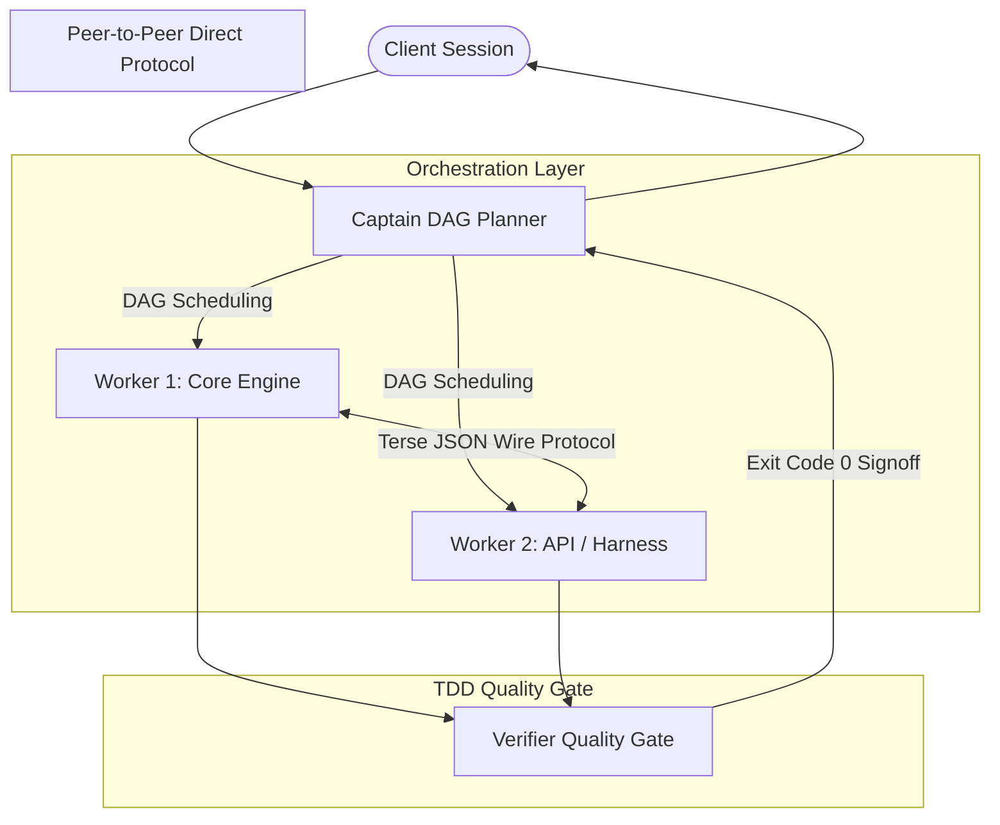

# CaveAgents Architecture & Design Specification

## Architecture Overview

CaveAgents implements an ultra-lean multi-agent orchestration architecture engineered specifically to eliminate the multi-agent token tax. The architecture balances strict supervisory control with decentralized peer-to-peer execution.



---

## 1. Topology: Captain DAG with P2P Direct Coordination

Traditional multi-agent frameworks use either a strictly centralized star topology (where every message routes through the lead agent, multiplying token overhead) or an unconstrained mesh (which leads to coordination chaos).

CaveAgents utilizes a hybrid topology:
- **Supervisory DAG Scheduling**: The `cave_captain` analyzes the user request, breaks it into a Directed Acyclic Graph (DAG) of parallel tasks, and instantiates worker subagents.
- **Direct P2P Communication**: Workers communicate directly with peers via `send_message(Recipient=worker_id)` using compact wire payloads. They exchange interface schemas, types, and completion signals without echoing content into the Captain's context window.
- **Hermetic Context Boundaries**: Each worker operates within its own isolated context window, preventing context contamination and quadratic attention overhead.

---

## 2. Dynamic Tool Pruning

The single largest contributor to multi-agent token inflation in standard platforms is static tool registration. When a framework registers 15–20 generic tools (browsers, code runners, image generators, scratchpads, scheduling timers), the JSON Schema definitions consume **~2,500 to 3,500 tokens on every single turn**:

$$\text{Tool Overhead Per Turn} \approx 2{,}500 \text{ tokens}$$

If three subagents each perform 8 tool calls, unpruned schemas alone consume:

$$3 \times 8 \times 2{,}500 = 60{,}000 \text{ tokens wasted on schemas!}$$

### Pruning via `define_subagent`

CaveAgents solves this by dynamically pruning tool registries during subagent creation:

```python
# Subagent definition with pruned tool surface
captain.define_subagent(
    name="cave_worker_core",
    tools=[
        "run_command",
        "write_to_file",
        "replace_file_content",
        "view_file",
        "send_message",
    ],  # Pruned: search_web, read_url, generate_image, notebook_edit omitted
    system_instruction="Caveman ultra-active. ASD-STE100 terse. Immediate tool invocation.",
)
```

By retaining only the 5 essential engineering tools, tool declaration overhead drops from ~2,500 tokens down to ~400 tokens per turn—**saving ~2,100 to 2,500 tokens per step**.

---

## 3. Protocol: ASD-STE100 Terse Wire Formatting

The CaveAgents communication protocol strictly enforces ASD-STE100 (Simplified Technical English) formatting.

### Prohibited Conversational Chaff
- Politeness markers: "Hello", "Thank you", "Kind regards"
- Explanatory narrations: "I will now proceed to view line 45 of file X"
- Speculative hedging: "I think perhaps we might want to check..."

### Wire Serialization Schema
Inter-agent messages are serialized into compact, whitespace-minimized JSON wire strings:

```json
{"sender":"w1","recipient":"w2","action":"SYNC","payload":{"interface":"CostEvaluator","status":"ready"},"summary":"API ready"}
```

This compact format reduces message overhead by up to 80% compared to typical conversational multi-agent markdown exchanges.

---

## 4. TDD Quality Gates

CaveAgents enforces deterministic validation at task boundaries:
1. **Automated Test Runners**: Code changes must be validated with targeted unit and integration test harnesses (e.g., `pytest tests/ -q --tb=short`).
2. **Short-Circuit Verification**: Test commands use short tracebacks and quiet output flags to prevent large trace dumps from entering the context window during failure iterations.
3. **Zero-Tolerance Gate**: Workers cannot report completion to the Captain without a confirmed exit code of 0.
