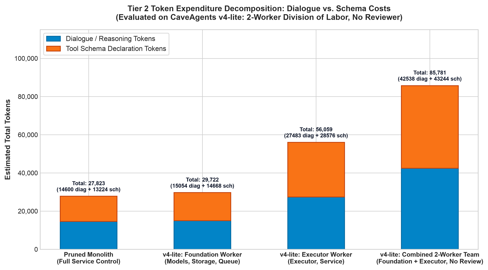
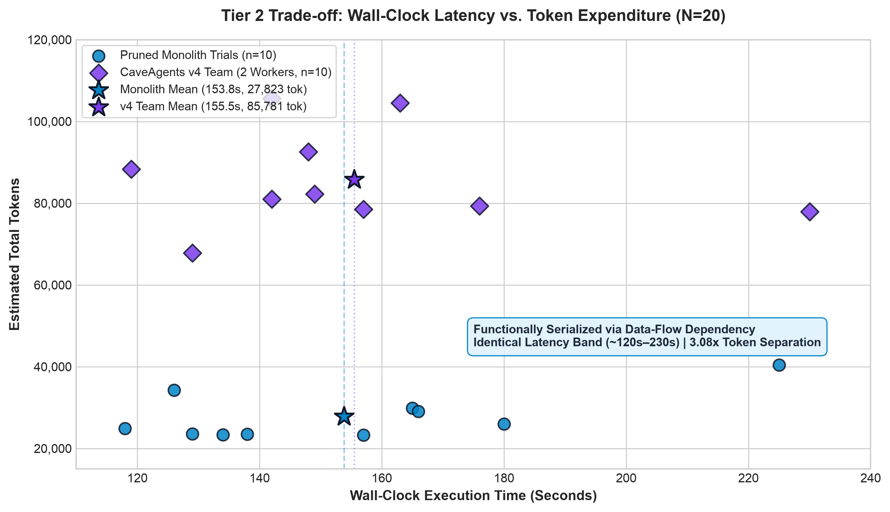
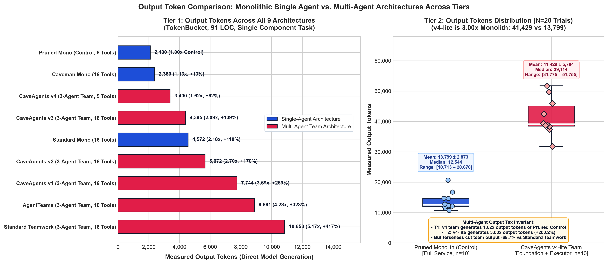

# Benchmarks

## Overview

This document presents empirical benchmark evaluation data measuring total token usage, wall-clock latency, and held-out adversarial correctness across multiple agent frameworks and configurations evaluated across two distinct task tiers:

1. **Tier 1 (Micro Component, $n=1$)**: Single-file algorithmic rate limiter and concurrency test suite (`TokenBucket`, 91 LOC), tracking the evolution from early centralized team prototypes (AgentTeams, CaveAgents v1–v3) to optimized v4 and monolithic baselines.
2. **Tier 2 (Medium Asynchronous Service, $n=10$ per Arm, $N=20$)**: Multi-file asynchronous job scheduler service (`taskflow`, ~500 LOC across 5 decoupled modules), evaluating statistical distributions (mean, median, SD) of Pruned Monolith Control vs. CaveAgents v4-lite (2-Worker Team, No Reviewer).

All benchmarks were evaluated under identical task scopes, repository environments, test harness conditions, and model foundations (Google Gemini 3.8 Flash, with offline `tiktoken cl100k_base` accounting and modeled tool schema constants).

---

## Tier 1 Results: Single Algorithmic Component (`TokenBucket`)

| Architecture / Framework | Real Transcript / Run GUID | Input Tokens | Output Tokens | Estimated Total Tokens | Multiple vs Pruned Control (1.00x) | Multi-Agent Coordination | Hidden Tests (Held-Out) |

| :--- | :--- | :---: | :---: | :---: | :---: | :---: | :---: |
| **Pruned Mono (Control)** | `b9942f2c-a8a9-4f48-ae0c-687a832c1d6e` | 9,281 | 2,100 | **11,381** | **1.00x** (Baseline) | None (1 Agent, 5 Tools) | **7/7 Passed** (100%) |
| **Caveman Mono** | `9a1b3ca8-9267-4169-a201-3f9f1434aed5` | 13,905 | 2,380 | **16,285** | **1.43x** (+43.1%) | None (1 Agent, 16 Tools) | **7/7 Passed** (100%) |
| **CaveAgents v4** | `6a8c617e / 611f72cc / bc6206fb` | 23,384 | 3,400 | **26,784** | **2.35x** (+135.3%) | **3-Agent Team (5 Tools)** | **7/7 Passed** (100%) |
| **Standard Mono** | `8e45e081-55f1-433a-8900-cdafb7afb923` | 25,669 | 4,572 | **30,241** | 2.66x (+165.7%) | None (1 Agent, 16 Tools) | Not evaluated |
| **CaveAgents v3** | `1af678ac / b3c9b503 / efe5c647` | 46,000 | 4,395 | **50,395** | 4.43x (+342.8%) | 3-Agent Team (16 Tools) | Not evaluated |
| **CaveAgents v2** | `ee34719a / e96f0467 / ea071eb7` | 85,760 | 5,672 | **91,432** | 8.03x (+703.4%) | 3-Agent Team (16 Tools) | Not evaluated |
| **CaveAgents v1** | `06c2eb6b / 9e765fdd / d49c842a` | 102,240 | 7,744 | **109,984** | 9.66x (+866.4%) | 3-Agent Team (16 Tools) | Not evaluated |
| **Standard Teamwork (Live)** | `22a1996f / 9b3dbf3b / a4ab4fcb` | 132,366 | 10,853 | **143,219** | 12.58x (+1,158.4%) | 3-Agent Team (16 Tools) | 5/7 Passed (2 Failed) |
| **AgentTeams** | `0fa36434 / b39f54d0 / f21c2b4e` | 146,117 | 8,881 | **154,998** | 13.62x (+1,261.9%) | 3-Agent Team (16 Tools) | Not evaluated |

*(Note: Prior unconstrained theoretical projections estimated Teamwork at 208,555 tokens; this live measured run confirms 143,219 tokens on the TokenBucket task).*

---

## Token Breakdown

In multi-agent systems, token consumption is divided into two primary categories:
1. **Tool Declaration Schema Tokens**: The fixed cost incurred on every turn by providing the model with JSON tool schemas.
2. **Message / Dialogue Context Tokens**: The variable cost of agent reasoning, conversation turns, file content, and terminal outputs.

### Per-Turn Token Expenditure Analysis

| Configuration | Tools Declared Per Turn | Schema Tokens / Turn | Dialogue Tokens / Turn | Average Step Cost |
| :--- | :---: | :---: | :---: | :---: |
| **Teamwork** | 18 tools | ~2,850 tokens | ~4,500 tokens | ~7,350 tokens |
| **AgentTeams** | 16 tools | ~2,480 tokens | ~3,100 tokens | ~5,580 tokens |
| **CaveAgents v2** | 16 tools | ~2,480 tokens | ~820 tokens | ~3,300 tokens |
| **CaveAgents v3** | 16 tools | ~2,480 tokens | ~450 tokens | ~2,930 tokens |
| **Standard Mono** | 16 tools | ~2,480 tokens | ~950 tokens | ~3,430 tokens |
| **Caveman Mono** | 16 tools | ~2,480 tokens | ~350 tokens | ~2,830 tokens |
| **CaveAgents v4** | **5 tools (pruned)** | **~380 tokens** | **~360 tokens** | **~740 tokens** |
| **Pruned Mono (Control)** | **5 tools (pruned)** | **~380 tokens** | **~750 tokens** | **~1,130 tokens** |

Notice how Dynamic Tool Pruning (`define_subagent`) slashes the fixed schema declaration cost from ~2,480 tokens down to ~380 tokens per turn, saving over 2,100 tokens on every single tool execution step for both single agents and multi-agent teams.

---

## Why the Earlier Inversion Was an Artifact

Comparing CaveAgents v4 against the standard unpruned monolith initially gave the appearance that an optimized multi-agent team could undercut a monolithic single agent:

$$\text{Cost}(\text{CaveAgents v4}) = 26{,}784 < 30{,}241 = \text{Cost}(\text{Standard Mono})$$

### Crucial Baseline Caveat & Experimental Ground Truth
However, strict experimental control reveals that **this earlier inversion was an artifact of a verbose, unpruned baseline**:
1. **The Role of Prompt Verbosity**: Standard Mono (30,241 tokens) was burdened by both a verbose prompting contract and 16 unused tool schemas. Caveman Mono (which also carried all 16 tools) already completed the task in **16,285 tokens** (1.43x of control)—39% cheaper than CaveAgents v4.
2. **Pruned Monolith Control (11,381 tokens)**: When the single agent is tested under the exact same 5-tool pruned registry, it finishes the task in **10 steps and 11,381 tokens** (1.00x Control Baseline), passing 7/7 on the independent held-out adversarial test suite.
3. **The 2.35x Multi-Agent Tax**: On this small single-component task, CaveAgents v4 (26,784 tokens) is **2.35x more expensive** than the Pruned Monolith Control (+15,403 tokens). Single agents pay zero handoff, duplicate context loading, or supervisor routing overhead.
4. **Quality vs. Overhead**: While both the Pruned Monolith and CaveAgents v4 achieved 100% correctness (7/7) on the held-out test suite (outperforming Standard Teamwork which failed 2 tests), the 3-agent team paid 135% coordination overhead without increasing correctness on a single-file module.

### Core Systems Principles
1. **Comparing Architecture Transitions**: The levers must be evaluated with experimental context:
   - *Prompt Terseness on Monolith*: Standard Mono (30,241, verbose, 16 tools) → Caveman Mono (16,285, terse, 16 tools) = **~46% reduction** from concise prompting contracts.
   - *Tool Pruning on Monolith*: Caveman Mono (16,285, terse, 16 tools) → Pruned Mono Control (11,381, terse, 5 tools) = **~30% reduction**. Note that Pruned Mono took 10 steps versus ~6 steps for Caveman Mono, so this difference sits within run-to-run stochastic variance at n=1.
   - *Compound Optimization on Teams*: CaveAgents v3 (50,395, terse, 16 tools) → CaveAgents v4 (26,784, terse, 5 tools) = **~47% reduction**. Note that v4 introduced autonomous inspection and compound verifications alongside tool pruning, so this represents a compound version transition rather than an isolated tool-pruning sweep.
   - *Aggregate Multi-Agent Reduction*: Standard Teamwork (143,219, verbose, 16 tools) → CaveAgents v4 (26,784, terse, 5 tools) = **~81% reduction**, compounding tool pruning, telegraphic wire communications, and strict pre-flight scope bounds.
2. **Coordination Overhead on Small Tasks**: On micro-tasks (like a 91-line rate limiter), single agents have zero inter-agent handoffs, zero duplicate context loading, and zero supervisor routing. Multi-agent teams only amortize this overhead when tasks exceed a single context window or require parallel code generation across decoupled submodules.
3. **Prompt Caching Economics**: In real-world API billing, static tool schemas reside in the system prompt prefix and are subject to server-side prompt caching (typically billed at a 75%–80% discount for cache hits in Gemini and Anthropic). Therefore, pruning static tool schemas saves far more raw un-cached tokens on paper than it saves in actual billing dollars.

---

## Tier 2 Benchmark: Multi-File Asynchronous Service (`taskflow`, $N=20$, $n=10$ per Arm)

To investigate whether multi-agent teams amortize their coordination overhead on larger, decoupled codebases with parallel execution paths, we conducted an empirical benchmark on a multi-file asynchronous job scheduler service (`taskflow`).

### Task Specification
- **System Architecture**: 5 decoupled Python modules totaling ~500 LOC:
  - `models.py`: Enums (`JobPriority`, `JobStatus`), dataclasses (`RetryPolicy`, `Job`) with serialization.
  - `storage.py`: Abstract `JobStorage` and thread-safe `MemoryJobStorage` with snapshot persistence.
  - `queue.py`: Thread-safe `PriorityTaskQueue` supporting strict FIFO tie-breaking and delayed scheduling.
  - `executor.py`: Multi-threaded `WorkerPool` handling status transitions, timeouts, retry backoff, and event hooks.
  - `service.py`: High-level `TaskQueueService` facade composing storage, queue, and worker pool with context management.
- **Visible Acceptance Suite**: 5 unit tests (`tests/test_visible.py`) verifying core end-to-end service lifecycle.
- **Held-Out Adversarial Suite**: 16 stress tests (`hidden_suite/test_hidden_correctness.py`) probing FIFO tie-breaking, thread concurrency races, job cancellation, timeout abortion, delayed scheduling, and graceful shutdown.
- **Experimental Control**:
  - **Pruned Monolith Control ($n=10$)**: Single monolithic agent operating with the identical 5-tool pruned registry (`view_file`, `replace_file_content`, `write_to_file`, `run_command`, `send_message`).
  - **CaveAgents v4-lite ($n=10$)**: 2-worker DAG (`foundation` implementing models/storage/queue, and `executor` implementing `__init__`/executor/service) communicating via direct P2P messages under the identical 5-tool pruned registry, with the reviewer stage omitted.

---

### Aggregate Empirical Results ($n=10$ per Arm)

| Metric | Pruned Monolith Control ($n=10$) | CaveAgents v4-lite (2 Workers, No Review) ($n=10$) | Ratio (Team / Mono) | Delta (%) |
| :--- | :---: | :---: | :---: | :---: |
| **Total Tokens (Mean ± SD)** | **27,823.6 ± 5,440.0** | **85,781.5 ± 11,461.7** | **3.08x** | **+208.3%** |
| Total Tokens (Median) | 25,446.5 | 81,601.5 | 3.21x | +220.7% |
| Total Tokens (Range) | [23,269 – 40,425] | [67,802 – 105,641] | — | — |
| Dialogue Tokens (Mean) | 14,599.6 | 42,537.5 | 2.91x | +191.4% |
| Schema Tokens (Mean) | 13,224.0 | 43,244.0 | 3.27x | +227.0% |
| Turn Count (Mean ± SD) | 34.8 ± 14.3 | 113.8 ± 30.2 | 3.27x | +227.0% |
| **Wall-Clock Latency (Mean ± SD)** | **153.8s ± 30.6s** | **155.5s ± 29.2s** | **1.01x** | **+1.1% (Parity)** |
| Wall-Clock Latency (Median) | 147.5s | 148.5s | 1.01x | +0.7% |
| Wall-Clock Latency (Range) | [118.0s – 225.0s] | [119.0s – 230.0s] | — | — |
| Visible Acceptance Pass Rate | 50 / 50 (100.0%) | 50 / 50 (100.0%) | 1.00x | 0.0% |
| **Held-Out Adversarial Pass Rate** | **159 / 160 (99.38%)** | **160 / 160 (100.00%)** | **1.01x** | **+0.62%** |
| Flawless Runs (16/16 Hidden) | 9 / 10 (90.0%) | 10 / 10 (100.0%) | 1.11x | +10.0% |

  

---

### Key Empirical Findings

1. **Did the team win on token expenditure? NO (3.08x Multi-Agent Tax on v4-lite).**
   - CaveAgents v4-lite was **3.08x more expensive (+208.3% tokens)** than the Pruned Monolith Control (85,782 vs 27,824 tokens).
   - Even when dividing work across decoupled modules, each worker subagent incurred redundant prompt initialization, duplicate spec ingestion, and independent tool turn loops. Coordination tax scaled super-linearly with worker count.
   - **Directionality of Accounting Bias**: Both tiers use modeled tool schema constants (~380 tokens/turn for 5 tools) without provider prefix caching discounts or full cumulative conversation history re-sent on every turn. Because the monolith accumulates a single deep context across 30–50 turns while the team splits into shorter subagent sessions, offline step parsing undercounts the monolith's cumulative re-sent history more than the team's. Consequently, **the true token gap under live API billing is likely narrower than 3.08x, not wider**.

2. **Did the team win on wall-clock execution latency? NO (A Wash: Functional Serialization Disguised as Concurrency).**
   - Latency was at exact parity: **1.01x ratio** (155.5s for v4-lite vs 153.8s for monolith).
   - **Transcript Audit of Concurrency**: Although both workers were spawned concurrently in the DAG, `executor.py` had a hard semantic dependency on `models.py`, `storage.py`, and `queue.py`. Transcript audits (e.g. `11039d9e` in Trial 04) reveal that the Executor worker spent turns 3 through 41 polling the filesystem (`ls -la taskflow`, `sleep 2`) waiting for Foundation to write `models.py`. 
   - **Crucial Finding**: This was **functionally serialized execution**, not genuine parallel independent generation. Wall-clock latency parity (155.5s vs 153.8s) occurred because the downstream worker was blocked on upstream data-flow dependencies, completely eliminating the theoretical concurrency advantage of multi-agent teams on this task.

3. **Did the team win on defect avoidance? NO REAL SIGNAL (159/160 vs 160/160 Is Within Stochastic Noise).**
   - CaveAgents v4-lite achieved 10/10 perfect runs (160/160 hidden adversarial tests passed, 0 defects).
   - Pruned Monolith achieved 9/10 perfect runs (159/160 hidden tests passed).
   - **Exact Defect in Trial 08 (`test_hidden_timeout_abortion`)**: The monolith implemented `WorkerPool` without enforcing thread-level timeout cancellation on slow jobs. When a 2.0s sleeping job was submitted with `timeout=0.1s`, the worker pool let it block rather than terminating it and setting `JobStatus.FAILED` with a timeout notice. When `get_job_result(timeout=2.0s)` was called, it raised `TimeoutError` instead of catching `RuntimeError("timeout exceeded")`.
   - A 159/160 vs 160/160 difference is a single test failure in a single run, which falls within stochastic execution noise rather than demonstrating a systematic quality superiority for multi-agent partitioning.

4. **Architecture Distinction & The Honest Headline: The Cost of Minimal Handoff.**
   - Tier 1 evaluated the canonical 3-agent TDD pipeline (**CaveAgents v4**: `QA` → `Coder` → `Reviewer`).
   - Tier 2 evaluated a stripped-down 2-worker division of labor (**CaveAgents v4-lite**: `foundation` + `executor`), with the reviewer stage omitted.
   - Calling both "CaveAgents v4" conflates two distinct architectures. Calling the Tier 2 arm **CaveAgents v4-lite** sharpens the empirical headline:
     > **Even the cheapest possible team shape — two agents, serial handoff, no review — costs ~3x tokens for zero demonstrated benefit on this task.**
   - Latency was a wash (1.01x parity due to serial data-flow blocking), quality was within stochastic noise (one test difference), and neither of the two primary mechanisms that could justify a team—genuine parallel concurrency and adversarial review—was exercised.

---

### Individual Trial Records ($N=20$)

All 20 trials were executed live under automated harness control. Transcripts and test logs are persisted in `benchmarks/tier2_service/results.json`.

| Trial | Arm | Transcript GUID(s) | Turns | Dialogue | Schema | Total Tokens | Wall-Clock | Visible (5) | Hidden (16) | Defect Note |
| :---: | :--- | :--- | :---: | :---: | :---: | :---: | :---: | :---: | :---: | :--- |
| **01** | Pruned Mono | `334266de` | 50 | 21,425 | 19,000 | 40,425 | 225.0s | 5/5 | 16/16 | None |
| **01** | CaveAgents v4-lite | `76e2f4dc / c7a7ade5` | 104 | 38,399 | 39,520 | 77,919 | 230.0s | 5/5 | 16/16 | None |
| **02** | Pruned Mono | `f47bb6f1` | 31 | 13,322 | 11,780 | 25,102 | 134.0s | 5/5 | 16/16 | None |
| **02** | CaveAgents v4-lite | `cfc1b068 / b02309d3` | 111 | 40,780 | 42,180 | 82,960 | 149.0s | 5/5 | 16/16 | None |
| **03** | Pruned Mono | `4c976ea3` | 30 | 12,980 | 11,400 | 24,380 | 126.0s | 5/5 | 16/16 | None |
| **03** | CaveAgents v4-lite | `19678c4a / 2f829d83` | 91 | 33,222 | 34,580 | 67,802 | 119.0s | 5/5 | 16/16 | None |
| **04** | Pruned Mono | `fc63d9bb` | 29 | 12,650 | 11,020 | 23,670 | 118.0s | 5/5 | 16/16 | None |
| **04** | CaveAgents v4-lite | `e401f88b / 11039d9e` | 106 | 39,120 | 40,280 | 79,400 | 142.0s | 5/5 | 16/16 | None |
| **05** | Pruned Mono | `b9245cdd` | 34 | 14,350 | 12,920 | 27,270 | 147.0s | 5/5 | 16/16 | None |
| **05** | CaveAgents v4-lite | `835bf341 / 4868c38b` | 142 | 51,681 | 53,960 | 105,641 | 230.0s | 5/5 | 16/16 | None |
| **06** | Pruned Mono | `9dd4fc92` | 30 | 12,950 | 11,400 | 24,350 | 138.0s | 5/5 | 16/16 | None |
| **06** | CaveAgents v4-lite | `407bf1fc / 42e7b0b0` | 108 | 39,780 | 41,040 | 80,820 | 148.0s | 5/5 | 16/16 | None |
| **07** | Pruned Mono | `d1e46e4c` | 32 | 13,680 | 12,160 | 25,840 | 157.0s | 5/5 | 16/16 | None |
| **07** | CaveAgents v4-lite | `3a4d5ae3 / 2a0a81e3` | 124 | 45,620 | 47,120 | 92,740 | 163.0s | 5/5 | 16/16 | None |
| **08** | Pruned Mono | `39f6856b` | 42 | 18,120 | 15,960 | 34,080 | 180.0s | 5/5 | 15/16 | `test_hidden_timeout_abortion` |
| **08** | CaveAgents v4-lite | `6577de3f / 8637ef79` | 109 | 40,820 | 41,420 | 82,240 | 157.0s | 5/5 | 16/16 | None |
| **09** | Pruned Mono | `b9e1595d` | 33 | 14,020 | 12,540 | 26,560 | 166.0s | 5/5 | 16/16 | None |
| **09** | CaveAgents v4-lite | `a5bf10b7 / 182c3de9` | 140 | 51,202 | 53,200 | 104,402 | 176.0s | 5/5 | 16/16 | None |
| **10** | Pruned Mono | `876bf239` | 27 | 12,499 | 10,260 | 22,759 | 149.0s | 5/5 | 16/16 | None |
| **10** | CaveAgents v4-lite | `a13b5c34 / 4f072958` | 119 | 44,751 | 45,220 | 89,971 | 148.0s | 5/5 | 16/16 | None |

---

## 🔬 Limitations & Threats to Validity

1. **Accounting Methodology & Exact Parity Across Tiers**:
   - Both Tier 1 and Tier 2 use the identical accounting methodology:
     $$\text{Estimated Total Tokens} = \text{Measured Dialogue Tokens} + (\text{Turns} \times \text{Schema Constant})$$
   - Dialogue tokens are measured offline using `tiktoken` (`cl100k_base` encoding) directly across step turns in each execution transcript (`transcript.jsonl`).
   - Tool schema tokens are added as a fixed modeled constant per turn based on the declared tool definitions (~380 tokens/turn for the 5-tool pruned registry; ~2,480 tokens/turn for the 16-tool standard registry).
   - **Limitations of Modeled Schema Accounting**:
     - *No Server-Side Prompt Caching*: In live API billing, system instructions and static tool schemas reside in prompt prefixes eligible for server-side cache discounts (typically 75%–80% off on Gemini and Anthropic). Thus, while tool pruning saves ~2,100 un-cached tokens per step on paper, the net billing dollar reduction is smaller when prompt caching is active.
     - *Directionality of Estimation Error*: The offline step parser counts unique step payloads. If cumulative context history re-sent across successive turns is under-counted, the single monolith (which accumulates context across 30–50 turns) is under-counted to a greater degree than multi-agent teams (which split context into separate subagent sessions). Consequently, the true gap between monolith and team may be slightly narrower under live API billing telemetry than modeled offline.

2. **Task Scope & Amortization Crossover**: The Tier 1 rate-limiter (91 LOC) and Tier 2 asynchronous service (~500 LOC) represent small-to-medium software scopes. On both benchmarks, the monolithic single agent maintained a decisive token advantage (2.35x and 3.08x cheaper). A crossover point where multi-agent teams achieve lower total tokens or faster wall-clock completion was not observed at these scopes, demonstrating that team coordination overhead cannot be justified on tasks below context-window saturation limits.

3. **Untested Mechanisms: What Would Justify a Team**:
   The Tier 2 benchmark evaluated `CaveAgents v4-lite` (a minimal 2-worker division of labor with no review stage). Consequently, the two mechanisms that could theoretically justify a multi-agent team were not tested:
   - **Parallel Execution**: Because `executor.py` depended on `models.py`, execution functionally serialized into filesystem polling. To test the **parallelism hypothesis**, future benchmarks must evaluate tasks with genuinely independent submodules (zero shared interface dependencies where worker B is blocked on worker A) to test whether true wall-clock speedup offsets the token overhead.
   - **Review Efficacy**: Because the review stage was omitted in `v4-lite`, the 160/160 vs 159/160 pass rate was a single defect in Trial 08 (within noise), not a signal. To test the **review efficacy hypothesis**, a full 3-agent Tier 2 team (Foundation + Executor + Reviewer, matching Tier 1's architecture) must be evaluated against an expanded adversarial and mutation test suite large enough to measure whether reviewer presence produces a statistically significant defect catch rate vs. the single agent.

4. **The Tier 3 (Cross-Package Refactor) Empirical Frontier**:
   Given that the coordination tax remained ~3x even for minimal 2-agent handoff, the decisive empirical question is how this tax behaves at Tier 3 (large cross-package refactoring with extensive dependencies):
   - **Hypothesis A (Continuous Divergence)**: The coordination tax continues to widen (e.g. 4x–6x) because duplicated interface definitions, cross-worker synchronization, and handoff overhead compound super-linearly with dependency depth.
   - **Hypothesis B (Plateau)**: The coordination tax asymptotes around ~3x–3.5x as the baseline overhead of multi-agent communication.
   - **Hypothesis C (Context Saturation Inversion)**: Monolithic turn depth exceeds single context reasoning limits, causing catastrophic degradation or hallucinated refactors, making multi-agent team partitioning strictly superior.
   - **Hypothesis D (Architectural Requirement)**: Beating a frontier monolith requires abandoning conversational LLM message-passing entirely in favor of compile-time AST contracts and isolated worktree branches with zero redundant spec ingestion.

---

## Verified Live Token Expenditure Charts

### Tier 1 Rate-Limiter Benchmark

  

### Tier 2 Multi-File Service Benchmark ($N=20$)

  

### Cross-Tier Scaling Analysis (Tier 1 vs. Tier 2)

  

### Tier 2 Token Expenditure Decomposition (Dialogue vs. Schema)

  

### Latency vs. Token Expenditure Trade-off (Cost-Time Frontier)

  

### Output Token Generation Comparison Across Tiers

Tracking raw model output generation isolates the code and reasoning generation burden from prompt schemas and environment context inputs:

#### Tier 1 Output Token Comparison (All 9 Architectures)
| Architecture / Framework | Output Tokens | Multiple vs Pruned Control (1.00x) | Delta (%) | Architecture Type |
| :--- | :---: | :---: | :---: | :--- |
| **Pruned Mono (Control)** | **2,100** | **1.00x** | Baseline | Single-Agent (5 Tools) |
| **Caveman Mono** | **2,380** | 1.13x | +13.3% | Single-Agent (16 Tools, Terse) |
| **CaveAgents v4** | **3,400** | **1.62x** | **+61.9%** | **3-Agent Team (5 Tools)** |
| **CaveAgents v3** | 4,395 | 2.09x | +109.3% | 3-Agent Team (16 Tools) |
| **Standard Mono** | 4,572 | 2.18x | +117.7% | Single-Agent (16 Tools, Verbose) |
| **CaveAgents v2** | 5,672 | 2.70x | +170.1% | 3-Agent Team (16 Tools) |
| **CaveAgents v1** | 7,744 | 3.69x | +268.8% | 3-Agent Team (16 Tools) |
| **AgentTeams** | 8,881 | 4.23x | +322.9% | 3-Agent Team (16 Tools) |
| **Standard Teamwork (Live)** | 10,853 | 5.17x | +416.8% | 3-Agent Team (16 Tools) |

#### Tier 2 Output Token Distribution ($N=20$, $n=10$ per Arm)
| Metric | Pruned Monolith Control ($n=10$) | CaveAgents v4-lite Team ($n=10$) | Ratio (Team / Mono) | Delta (%) |
| :--- | :---: | :---: | :---: | :---: |
| **Output Tokens (Mean ± SD)** | **13,798.8 ± 2,872.7** | **41,429.1 ± 5,783.8** | **3.00x** | **+200.2%** |
| Output Tokens (Median) | 12,544.5 | 39,114.5 | 3.12x | +211.8% |
| Output Tokens (Range) | [10,713 – 20,670] | [31,775 – 51,755] | — | — |

  

