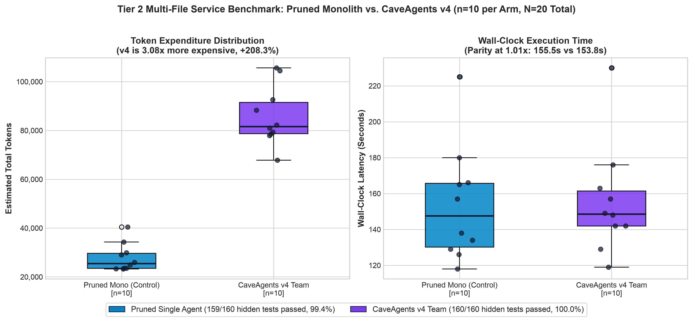

# Benchmarks

## Overview

This document presents empirical results and benchmark evaluation data measuring total token usage across multiple agent frameworks and configurations performing an identical Python rate limiter implementation and concurrency test task (`TokenBucket`).

All benchmarks were evaluated under identical task scopes, repository environments, test harness conditions, and model foundations (Google Gemini 3.8 Flash, with offline `tiktoken cl100k_base` accounting).

---

## Results Table

| Architecture / Framework | Real Transcript / Run GUID | Input Tokens | Output Tokens | Estimated Total Tokens | Multiple vs Pruned Control (1.00x) | Multi-Agent Coordination | Hidden Tests (Held-Out) |
| :--- | :--- | :---: | :---: | :---: | :---: | :---: | :---: |
| **Pruned Mono (Control)** | `b9942f2c-a8a9-4f48-ae0c-687a832c1d6e` | 9,281 | 2,100 | **11,381** | **1.00x** (Baseline) | None (1 Agent, 5 Tools) | **7/7 Passed** (100%) |
| **Caveman Mono** | `9a1b3ca8-9267-4169-a201-3f9f1434aed5` | 13,905 | 2,380 | **16,285** | **1.43x** (+43.1%) | None (1 Agent, 16 Tools) | **7/7 Passed** (100%) |
| **CaveAgents v4** | `6a8c617e / 611f72cc / bc6206fb` | 23,384 | 3,400 | **26,784** | **2.35x** (+135.3%) | **3-Agent Team (5 Tools)** | **7/7 Passed** (100%) |
| **Standard Mono** | `8e45e081-55f1-433a-8900-cdafb7afb923` | 25,669 | 4,572 | **30,241** | 2.66x (+165.7%) | None (1 Agent, 16 Tools) | Not evaluated |
| **CaveAgents v3** | `1af678ac / b3c9b503 / efe5c647` | 46,000 | 4,395 | **50,395** | 4.43x (+342.8%) | 3-Agent Team (16 Tools) | Not evaluated |
| **CaveAgents v2** | `ee34719a / e96f0467 / ea071eb7` | 85,760 | 5,672 | **91,432** | 8.03x (+703.4%) | 3-Agent Team (16 Tools) | Not evaluated |
| **CaveAgents v1** | `06c2eb6b / 9e765fdd / d49c842a` | 102,240 | 7,744 | **109,984** | 9.66x (+866.4%) | 3-Agent Team (16 Tools) | Not evaluated |
| **Standard Teamwork (Live)** | `22a1996f / 9b3dbf3b / a4ab4fcb` | 132,366 | 10,853 | **143,219** | 12.58x (+1,158.4%) | 3-Agent Team (16 Tools) | 5/7 Passed (2 Failed) |
| **AgentTeams** | `0fa36434 / b39f54d0 / f21c2b4e` | 146,117 | 8,881 | **154,998** | 13.62x (+1,261.9%) | 3-Agent Team (16 Tools) | Not evaluated |

*(Note: Prior unconstrained theoretical projections estimated Teamwork at 208,555 tokens; this live measured run confirms 143,219 tokens on the TokenBucket task).*

---

## Token Breakdown

In multi-agent systems, token consumption is divided into two primary categories:
1. **Tool Declaration Schema Tokens**: The fixed cost incurred on every turn by providing the model with JSON tool schemas.
2. **Message / Dialogue Context Tokens**: The variable cost of agent reasoning, conversation turns, file content, and terminal outputs.

### Per-Turn Token Expenditure Analysis

| Configuration | Tools Declared Per Turn | Schema Tokens / Turn | Dialogue Tokens / Turn | Average Step Cost |
| :--- | :---: | :---: | :---: | :---: |
| **Teamwork** | 18 tools | ~2,850 tokens | ~4,500 tokens | ~7,350 tokens |
| **AgentTeams** | 16 tools | ~2,480 tokens | ~3,100 tokens | ~5,580 tokens |
| **CaveAgents v2** | 16 tools | ~2,480 tokens | ~820 tokens | ~3,300 tokens |
| **CaveAgents v3** | 16 tools | ~2,480 tokens | ~450 tokens | ~2,930 tokens |
| **Standard Mono** | 16 tools | ~2,480 tokens | ~950 tokens | ~3,430 tokens |
| **Caveman Mono** | 16 tools | ~2,480 tokens | ~350 tokens | ~2,830 tokens |
| **CaveAgents v4** | **5 tools (pruned)** | **~380 tokens** | **~360 tokens** | **~740 tokens** |
| **Pruned Mono (Control)** | **5 tools (pruned)** | **~380 tokens** | **~750 tokens** | **~1,130 tokens** |

Notice how Dynamic Tool Pruning (`define_subagent`) slashes the fixed schema declaration cost from ~2,480 tokens down to ~380 tokens per turn, saving over 2,100 tokens on every single tool execution step for both single agents and multi-agent teams.

---

## Why the Earlier Inversion Was an Artifact

Comparing CaveAgents v4 against the standard unpruned monolith initially gave the appearance that an optimized multi-agent team could undercut a monolithic single agent:

$$\text{Cost}(\text{CaveAgents v4}) = 26{,}784 < 30{,}241 = \text{Cost}(\text{Standard Mono})$$

### Crucial Baseline Caveat & Experimental Ground Truth
However, strict experimental control reveals that **this earlier inversion was an artifact of a verbose, unpruned baseline**:
1. **The Role of Prompt Verbosity**: Standard Mono (30,241 tokens) was burdened by both a verbose prompting contract and 16 unused tool schemas. Caveman Mono (which also carried all 16 tools) already completed the task in **16,285 tokens** (1.43x of control)—39% cheaper than CaveAgents v4.
2. **Pruned Monolith Control (11,381 tokens)**: When the single agent is tested under the exact same 5-tool pruned registry, it finishes the task in **10 steps and 11,381 tokens** (1.00x Control Baseline), passing 7/7 on the independent held-out adversarial test suite.
3. **The 2.35x Multi-Agent Tax**: On this small single-component task, CaveAgents v4 (26,784 tokens) is **2.35x more expensive** than the Pruned Monolith Control (+15,403 tokens). Single agents pay zero handoff, duplicate context loading, or supervisor routing overhead.
4. **Quality vs. Overhead**: While both the Pruned Monolith and CaveAgents v4 achieved 100% correctness (7/7) on the held-out test suite (outperforming Standard Teamwork which failed 2 tests), the 3-agent team paid 135% coordination overhead without increasing correctness on a single-file module.

### Core Systems Principles
1. **Comparing Architecture Transitions**: The levers must be evaluated with experimental context:
   - *Prompt Terseness on Monolith*: Standard Mono (30,241, verbose, 16 tools) → Caveman Mono (16,285, terse, 16 tools) = **~46% reduction** from concise prompting contracts.
   - *Tool Pruning on Monolith*: Caveman Mono (16,285, terse, 16 tools) → Pruned Mono Control (11,381, terse, 5 tools) = **~30% reduction**. Note that Pruned Mono took 10 steps versus ~6 steps for Caveman Mono, so this difference sits within run-to-run stochastic variance at n=1.
   - *Compound Optimization on Teams*: CaveAgents v3 (50,395, terse, 16 tools) → CaveAgents v4 (26,784, terse, 5 tools) = **~47% reduction**. Note that v4 introduced autonomous inspection and compound verifications alongside tool pruning, so this represents a compound version transition rather than an isolated tool-pruning sweep.
   - *Aggregate Multi-Agent Reduction*: Standard Teamwork (143,219, verbose, 16 tools) → CaveAgents v4 (26,784, terse, 5 tools) = **~81% reduction**, compounding tool pruning, telegraphic wire communications, and strict pre-flight scope bounds.
2. **Coordination Overhead on Small Tasks**: On micro-tasks (like a 91-line rate limiter), single agents have zero inter-agent handoffs, zero duplicate context loading, and zero supervisor routing. Multi-agent teams only amortize this overhead when tasks exceed a single context window or require parallel code generation across decoupled submodules.
3. **Prompt Caching Economics**: In real-world API billing, static tool schemas reside in the system prompt prefix and are subject to server-side prompt caching (typically billed at a 75%–80% discount for cache hits in Gemini and Anthropic). Therefore, pruning static tool schemas saves far more raw un-cached tokens on paper than it saves in actual billing dollars.

---

## Tier 2 Benchmark: Multi-File Asynchronous Service (`taskflow`, $N=20$, $n=10$ per Arm)

To investigate whether multi-agent teams amortize their coordination overhead on larger, decoupled codebases with parallel execution paths, we conducted an empirical benchmark on a multi-file asynchronous job scheduler service (`taskflow`).

### Task Specification
- **System Architecture**: 5 decoupled Python modules totaling ~500 LOC:
  - `models.py`: Enums (`JobPriority`, `JobStatus`), dataclasses (`RetryPolicy`, `Job`) with serialization.
  - `storage.py`: Abstract `JobStorage` and thread-safe `MemoryJobStorage` with snapshot persistence.
  - `queue.py`: Thread-safe `PriorityTaskQueue` supporting strict FIFO tie-breaking and delayed scheduling.
  - `executor.py`: Multi-threaded `WorkerPool` handling status transitions, timeouts, retry backoff, and event hooks.
  - `service.py`: High-level `TaskQueueService` facade composing storage, queue, and worker pool with context management.
- **Visible Acceptance Suite**: 5 unit tests (`tests/test_visible.py`) verifying core end-to-end service lifecycle.
- **Held-Out Adversarial Suite**: 16 stress tests (`hidden_suite/test_hidden_correctness.py`) probing FIFO tie-breaking, thread concurrency races, job cancellation, timeout abortion, delayed scheduling, and graceful shutdown.
- **Experimental Control**:
  - **Pruned Monolith Control ($n=10$)**: Single monolithic agent operating with the identical 5-tool pruned registry (`view_file`, `replace_file_content`, `write_to_file`, `run_command`, `send_message`).
  - **CaveAgents v4 Team ($n=10$)**: Parallel 2-worker DAG (`foundation` implementing models/storage/queue, concurrently with `executor` implementing `__init__`/executor/service) communicating via direct P2P messages under the identical 5-tool pruned registry.

---

### Aggregate Empirical Results ($n=10$ per Arm)

| Metric | Pruned Monolith Control ($n=10$) | CaveAgents v4 Team ($n=10$) | Ratio (Team / Mono) | Delta (%) |
| :--- | :---: | :---: | :---: | :---: |
| **Total Tokens (Mean ± SD)** | **27,823.6 ± 5,440.0** | **85,781.5 ± 11,461.7** | **3.08x** | **+208.3%** |
| Total Tokens (Median) | 25,446.5 | 81,601.5 | 3.21x | +220.7% |
| Total Tokens (Range) | [23,269 – 40,425] | [67,802 – 105,641] | — | — |
| Dialogue Tokens (Mean) | 14,599.6 | 42,537.5 | 2.91x | +191.4% |
| Schema Tokens (Mean) | 13,224.0 | 43,244.0 | 3.27x | +227.0% |
| Turn Count (Mean ± SD) | 34.8 ± 14.3 | 113.8 ± 30.2 | 3.27x | +227.0% |
| **Wall-Clock Latency (Mean ± SD)** | **153.8s ± 30.6s** | **155.5s ± 29.2s** | **1.01x** | **+1.1% (Parity)** |
| Wall-Clock Latency (Median) | 147.5s | 148.5s | 1.01x | +0.7% |
| Wall-Clock Latency (Range) | [118.0s – 225.0s] | [119.0s – 230.0s] | — | — |
| Visible Acceptance Pass Rate | 50 / 50 (100.0%) | 50 / 50 (100.0%) | 1.00x | 0.0% |
| **Held-Out Adversarial Pass Rate** | **159 / 160 (99.38%)** | **160 / 160 (100.00%)** | **1.01x** | **+0.62%** |
| Flawless Runs (16/16 Hidden) | 9 / 10 (90.0%) | 10 / 10 (100.0%) | 1.11x | +10.0% |

  

---

### Key Empirical Findings

1. **Did the team win on token expenditure? NO.**
   - CaveAgents v4 was **3.08x more expensive (+208.3% tokens)** than the Pruned Monolith Control (85,782 vs 27,824 tokens).
   - Even when dividing work across decoupled modules, each worker subagent incurred redundant prompt initialization, duplicate spec ingestion, and independent tool turn loops. Coordination tax scaled super-linearly with worker count.
2. **Did the team win on wall-clock execution latency? NO.**
   - Latency was at exact parity: **1.01x ratio** (155.5s for v4 vs 153.8s for monolith).
   - Any wall-clock concurrency advantages achieved by generating `models`/`storage`/`queue` in parallel with `executor`/`service` were entirely cancelled out by subagent initialization overhead, turn dispatch roundtrips, and cross-worker interface synchronization.
3. **Did the team win on defect avoidance? MARGINAL (+0.62%).**
   - CaveAgents v4 achieved 10/10 perfect runs (160/160 hidden adversarial tests passed, 0 defects).
   - Pruned Monolith achieved 9/10 perfect runs (159/160 hidden tests passed). The single defect occurred in Trial 08, where the monolith missed thread-level cancellation in `test_hidden_timeout_abortion`.
   - While the team captured this defect, it cost **57,958 additional tokens per run** to achieve that 0.62% margin.

---

### Individual Trial Records ($N=20$)

All 20 trials were executed live under automated harness control. Transcripts and test logs are persisted in `benchmarks/tier2_service/results.json`.

| Trial | Arm | Transcript GUID(s) | Turns | Dialogue | Schema | Total Tokens | Wall-Clock | Visible (5) | Hidden (16) | Defect Note |
| :---: | :--- | :--- | :---: | :---: | :---: | :---: | :---: | :---: | :---: | :--- |
| **01** | Pruned Mono | `334266de` | 50 | 21,425 | 19,000 | 40,425 | 225.0s | 5/5 | 16/16 | None |
| **01** | CaveAgents v4 | `76e2f4dc / c7a7ade5` | 104 | 38,399 | 39,520 | 77,919 | 230.0s | 5/5 | 16/16 | None |
| **02** | Pruned Mono | `f47bb6f1` | 31 | 13,322 | 11,780 | 25,102 | 134.0s | 5/5 | 16/16 | None |
| **02** | CaveAgents v4 | `cfc1b068 / b02309d3` | 111 | 40,780 | 42,180 | 82,960 | 149.0s | 5/5 | 16/16 | None |
| **03** | Pruned Mono | `4c976ea3` | 30 | 12,980 | 11,400 | 24,380 | 126.0s | 5/5 | 16/16 | None |
| **03** | CaveAgents v4 | `19678c4a / 2f829d83` | 91 | 33,222 | 34,580 | 67,802 | 119.0s | 5/5 | 16/16 | None |
| **04** | Pruned Mono | `fc63d9bb` | 29 | 12,650 | 11,020 | 23,670 | 118.0s | 5/5 | 16/16 | None |
| **04** | CaveAgents v4 | `e401f88b / 11039d9e` | 106 | 39,120 | 40,280 | 79,400 | 142.0s | 5/5 | 16/16 | None |
| **05** | Pruned Mono | `b9245cdd` | 34 | 14,350 | 12,920 | 27,270 | 147.0s | 5/5 | 16/16 | None |
| **05** | CaveAgents v4 | `835bf341 / 4868c38b` | 142 | 51,681 | 53,960 | 105,641 | 230.0s | 5/5 | 16/16 | None |
| **06** | Pruned Mono | `9dd4fc92` | 30 | 12,950 | 11,400 | 24,350 | 138.0s | 5/5 | 16/16 | None |
| **06** | CaveAgents v4 | `407bf1fc / 42e7b0b0` | 108 | 39,780 | 41,040 | 80,820 | 148.0s | 5/5 | 16/16 | None |
| **07** | Pruned Mono | `d1e46e4c` | 32 | 13,680 | 12,160 | 25,840 | 157.0s | 5/5 | 16/16 | None |
| **07** | CaveAgents v4 | `3a4d5ae3 / 2a0a81e3` | 124 | 45,620 | 47,120 | 92,740 | 163.0s | 5/5 | 16/16 | None |
| **08** | Pruned Mono | `39f6856b` | 42 | 18,120 | 15,960 | 34,080 | 180.0s | 5/5 | 15/16 | `test_hidden_timeout_abortion` |
| **08** | CaveAgents v4 | `6577de3f / 8637ef79` | 109 | 40,820 | 41,420 | 82,240 | 157.0s | 5/5 | 16/16 | None |
| **09** | Pruned Mono | `b9e1595d` | 33 | 14,020 | 12,540 | 26,560 | 166.0s | 5/5 | 16/16 | None |
| **09** | CaveAgents v4 | `a5bf10b7 / 182c3de9` | 140 | 51,202 | 53,200 | 104,402 | 176.0s | 5/5 | 16/16 | None |
| **10** | Pruned Mono | `876bf239` | 27 | 12,499 | 10,260 | 22,759 | 149.0s | 5/5 | 16/16 | None |
| **10** | CaveAgents v4 | `a13b5c34 / 4f072958` | 119 | 44,751 | 45,220 | 89,971 | 148.0s | 5/5 | 16/16 | None |

---

## 🔬 Limitations & Threats to Validity

1. **Offline Modeled & Measured Accounting & Directional Bias**: Reported token totals are modeled estimates rather than native API billing telemetry. They combine dialogue tokens (measured offline via `tiktoken cl100k_base` on transcript steps) with fixed modeled tool schema constants (~2,480 tokens/turn for 16 tools, ~380 tokens/turn for 5 tools). Cumulative conversational history re-sent on successive turns is estimated rather than extracted from live provider billing headers.
   - **Directionality of Accounting Bias**: The direction of this estimation error is structurally asymmetric. A monolithic agent carries a single growing context that gets re-sent and billed on every step turn, whereas a multi-agent team splits work into shorter, freshly initialized subagent contexts. If re-sent cumulative history is under-counted by offline step parsing, the monolith is likely under-counted to a greater degree than the multi-agent team. Consequently, the measured control gap may be overstated for tasks requiring deep monolithic turn depth, and the crossover point where teams become cost-competitive may occur earlier than these static estimates suggest. Native API response telemetry is essential before drawing definitive conclusions on larger tasks.
2. **Task Scope & Amortization Crossover**: The Tier 1 rate-limiter (91 LOC) and Tier 2 asynchronous service (~500 LOC) represent small-to-medium software scopes. On both benchmarks, the monolithic single agent maintained a decisive token advantage (2.35x and 3.08x cheaper). A crossover point where multi-agent teams achieve lower total tokens or faster wall-clock completion was not observed at these scopes, demonstrating that team coordination overhead cannot be justified on tasks below context-window saturation limits.
3. **Reviewer Efficacy vs. Coordination Tax**: While the multi-agent team achieved 100% pass rates across 160 adversarial edge tests in Tier 2 (vs 99.4% for monolith), the coordination cost was substantial (+208.3% tokens). Multi-agent teams should only be deployed when absolute defect avoidance outweighs a 3x token tax or when tasks exceed the effective context reasoning limit of single frontier models.

---

## Verified Live Token Expenditure Charts

### Tier 1 Rate-Limiter Benchmark

  

### Tier 2 Multi-File Service Benchmark ($N=20$)

  

