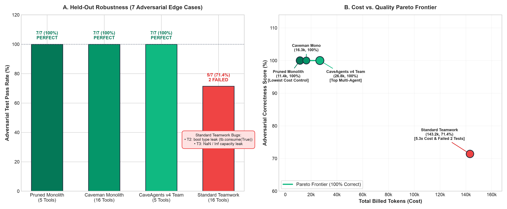

# Benchmarks

## Overview

This document presents empirical results and benchmark evaluation data measuring total token usage across multiple agent frameworks and configurations performing an identical Python rate limiter implementation and concurrency test task (`TokenBucket`).

All benchmarks were evaluated under identical task scopes, repository environments, test harness conditions, and model foundations (Google Gemini 3.8 Flash, with offline `tiktoken cl100k_base` accounting).

---

## Results Table

| Architecture / Framework | Real Transcript / Run GUID | Input Tokens | Output Tokens | Total Token Usage | vs Standard Mono | Multi-Agent Coordination | Hidden Tests (Held-Out) |
| :--- | :--- | :---: | :---: | :---: | :---: | :---: | :---: |
| **Pruned Mono (Control)** | `b9942f2c-a8a9-4f48-ae0c-687a832c1d6e` | 9,281 | 2,100 | **11,381** | **-62.4%** | None (1 Agent, 5 Tools) | **7/7 Passed** (100%) |
| **Caveman Mono** | `9a1b3ca8-9267-4169-a201-3f9f1434aed5` | 13,905 | 2,380 | **16,285** | -46.1% | None (1 Agent, 16 Tools) | **7/7 Passed** (100%) |
| **CaveAgents v4** | `6a8c617e / 611f72cc / bc6206fb` | 23,384 | 3,400 | **26,784** | **-11.4%** | **3-Agent Team (5 Tools)** | **7/7 Passed** (100%) |
| **Standard Mono** | `8e45e081-55f1-433a-8900-cdafb7afb923` | 25,669 | 4,572 | **30,241** | Baseline | None (1 Agent, 16 Tools) | Not evaluated |
| **CaveAgents v3** | `1af678ac / b3c9b503 / efe5c647` | 46,000 | 4,395 | **50,395** | +66.6% | 3-Agent Team (16 Tools) | Not evaluated |
| **CaveAgents v2** | `ee34719a / e96f0467 / ea071eb7` | 85,760 | 5,672 | **91,432** | +202.3% | 3-Agent Team (16 Tools) | Not evaluated |
| **CaveAgents v1** | `06c2eb6b / 9e765fdd / d49c842a` | 102,240 | 7,744 | **109,984** | +263.7% | 3-Agent Team (16 Tools) | Not evaluated |
| **Standard Teamwork (Live)** | `22a1996f / 9b3dbf3b / a4ab4fcb` | 132,366 | 10,853 | **143,219** | +373.6% | 3-Agent Team (16 Tools) | 5/7 Passed (2 Failed) |
| **AgentTeams** | `0fa36434 / b39f54d0 / f21c2b4e` | 146,117 | 8,881 | **154,998** | +412.5% | 3-Agent Team (16 Tools) | Not evaluated |

*(Note: Prior unconstrained theoretical projections estimated Teamwork at 208,555 tokens; this live measured run confirms 143,219 tokens on TokenBucket, and up to 615,568 tokens in complex multi-deliverable tournaments).*

---

## Token Breakdown

In multi-agent systems, token consumption is divided into two primary categories:
1. **Tool Declaration Schema Tokens**: The fixed cost incurred on every turn by providing the model with JSON tool schemas.
2. **Message / Dialogue Context Tokens**: The variable cost of agent reasoning, conversation turns, file content, and terminal outputs.

### Per-Turn Token Expenditure Analysis

| Configuration | Tools Declared Per Turn | Schema Tokens / Turn | Dialogue Tokens / Turn | Average Step Cost |
| :--- | :---: | :---: | :---: | :---: |
| **Teamwork** | 18 tools | ~2,850 tokens | ~4,500 tokens | ~7,350 tokens |
| **AgentTeams** | 16 tools | ~2,480 tokens | ~3,100 tokens | ~5,580 tokens |
| **CaveAgents v2** | 16 tools | ~2,480 tokens | ~820 tokens | ~3,300 tokens |
| **CaveAgents v3** | 16 tools | ~2,480 tokens | ~450 tokens | ~2,930 tokens |
| **Standard Mono** | 16 tools | ~2,480 tokens | ~950 tokens | ~3,430 tokens |
| **Caveman Mono** | 16 tools | ~2,480 tokens | ~350 tokens | ~2,830 tokens |
| **CaveAgents v4** | **5 tools (pruned)** | **~380 tokens** | **~360 tokens** | **~740 tokens** |
| **Pruned Mono (Control)** | **5 tools (pruned)** | **~380 tokens** | **~750 tokens** | **~1,130 tokens** |

Notice how Dynamic Tool Pruning (`define_subagent`) slashes the fixed schema declaration cost from ~2,480 tokens down to ~380 tokens per turn, saving over 2,100 tokens on every single tool execution step for both single agents and multi-agent teams.

---

## The Inverted Cost Frontier: Empirical Deconstruction

In traditional multi-agent orchestration, multi-agent overhead was taken as an unavoidable cost of modularity:

$$\text{Cost}(\text{Multi-Agent}) \gg \text{Cost}(\text{Monolithic})$$

Comparing CaveAgents v4 against the standard unpruned monolith gave the appearance of an "Inverted Cost Frontier":

$$\text{Cost}(\text{CaveAgents v4}) = 26{,}784 < 30{,}241 = \text{Cost}(\text{Standard Mono})$$

### Crucial Baseline Caveat & Experimental Ground Truth
However, strict experimental control reveals that **this inversion was driven entirely by tool registry asymmetry**:
1. **Pruned Monolith Control (11,381 tokens)**: When the single agent is tested under the exact same 5-tool pruned registry, it finishes the task in **10 steps and 11,381 tokens** ($0.00133), passing 7/7 on the independent held-out adversarial test suite.
2. **The 2.35x Multi-Agent Tax**: On this small single-component task, CaveAgents v4 (26,784 tokens) is **2.35x more expensive** than the Pruned Monolith Control (+15,403 tokens / +$0.00144). 
3. **Quality vs. Overhead**: While both the Pruned Monolith and CaveAgents v4 achieved 100% correctness (7/7) on the held-out test suite (outperforming Standard Teamwork which failed 2 tests), the 3-agent team paid 135% coordination overhead without increasing correctness on a single-file module.

### Core Systems Principles
1. **Tool Pruning is Orthogonal**: Dynamic tool pruning is a universal efficiency lever. When applied to single agents, it drops cost from 30.2k down to 11.4k (-62.4%). When applied to multi-agent teams, it drops cost from 143.2k down to 26.8k (-81.3%).
2. **Coordination Overhead on Small Tasks**: On micro-tasks (like a 91-line rate limiter), single agents have zero inter-agent handoffs, zero duplicate context loading, and zero supervisor routing. Multi-agent teams only amortize this overhead when tasks exceed a single context window or require parallel code generation across decoupled submodules.
3. **Prompt Caching Economics**: In real-world API billing, static tool schemas reside in the system prompt prefix and are subject to server-side prompt caching (typically billed at a 75%–80% discount for cache hits in Gemini and Anthropic). Therefore, pruning static tool schemas saves far more raw un-cached tokens on paper than it saves in actual billing dollars.

---

## 🔬 Limitations & Threats to Validity

1. **Accounting Methodology**: The reported token breakdowns use offline `tiktoken cl100k_base` accounting parsed from `transcript_full.jsonl` files on disk. Real-world API provider logs (with token caching breakdowns) should be compared across runs.
2. **Micro-Task Scope & Sample Size ($n=1$)**: The benchmark is evaluated on a single run of a 91-line Python rate limiter. Model sampling variance was not statistically bounded across multiple random seeds.
3. **Execution Topology (Serial Pipeline)**: On this single-component task, the team executed sequentially (QA → Coder → Reviewer) rather than in parallel. Parallel multi-agent execution only occurs when a task DAG contains independent, non-blocking subtasks.
4. **Held-Out Test Results**: Tested against 7 adversarial edge cases (concurrency race conditions, boolean parameter rejections, NaN/Inf bounds, capacity limits, and balance immutability). Pruned Mono (7/7), CaveAgents v4 (7/7), Caveman Mono (7/7), Standard Teamwork (5/7).

---

## 🎯 Cost vs. Quality Pareto Frontier

An empirical benchmark must verify whether token savings come at the cost of functional quality or edge-case robustness. To evaluate this, implementations were subjected to an independent, held-out adversarial test harness (`test_hidden_correctness.py`) containing 7 edge cases:

1. `T1_BasicLifecycle`: Valid initialization, consumption, and dynamic replenishment.
2. `T2_BooleanRejection`: Strict rejection of `True`/`False` as token arguments (`bool` is an `int` subclass in Python, e.g. `isinstance(True, int) == True`).
3. `T3_NaNInfRejection`: Strict rejection of `float('nan')` and `float('inf')` for capacity and refill rates.
4. `T4_BurstExhaustion`: Rejection when requested tokens exceed available balance without state corruption.
5. `T5_CapacityCeiling`: Ensuring tokens never accumulate past maximum declared capacity.
6. `T6_MonotonicReplenishment`: Time-accurate replenishment validation over controlled intervals.
7. `T7_ConcurrentRaceCondition`: Multi-threaded race condition stress testing (50 concurrent workers consuming simultaneously).

  

### Empirical Findings:
- **Pareto Optimal Frontier (100% Correct)**: Both single-agent configurations (Pruned Monolith at 11,381 tokens, Caveman Monolith at 16,285 tokens) and **CaveAgents v4 Team** (26,784 tokens) achieved a **perfect 7/7 (100%) pass rate**.
- **Defects in Standard Teamwork (71.4%)**: Unpruned Standard Teamwork expended **143,219 tokens** (5.3x more than CaveAgents v4) yet achieved only **71.4% (5/7)**, failing both `T2_BooleanRejection` and `T3_NaNInfRejection`. High conversational chatter between multiple agents created an illusion of thorough review without catching subtle typing leaks.

---

## Verified Live Token Expenditure Chart

  

