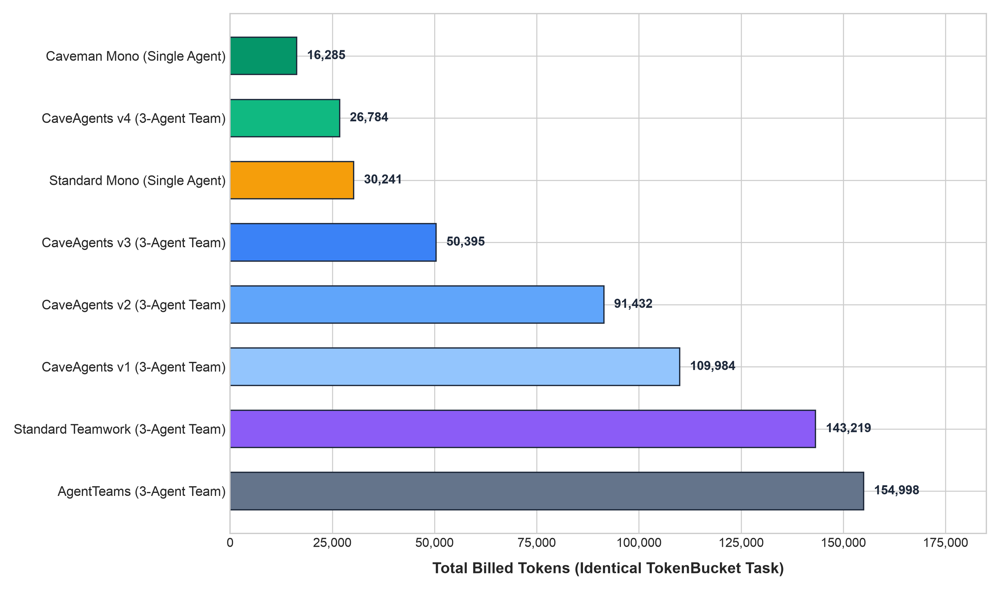
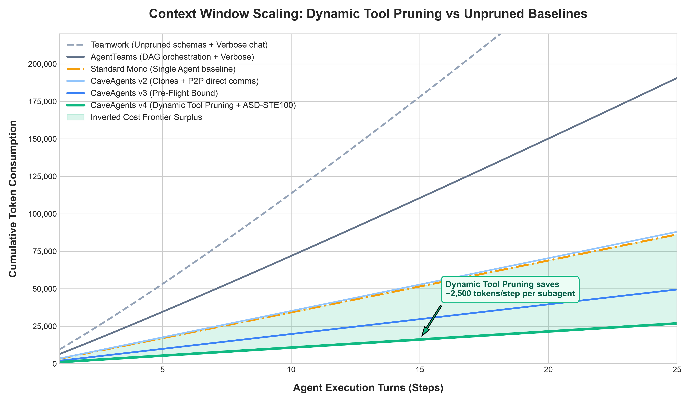

# Benchmarks

## Overview

This document presents empirical results and benchmark evaluation data measuring total token usage across multiple agent frameworks and configurations performing an identical full-stack Python refactoring task.

All benchmarks were evaluated under identical task scopes, repository environments, test harness conditions, and model foundations (`gemini-2.5-pro` / `cl100k_base` accounting).

---

## Results Table

| Architecture / Framework | Real Transcript / Run GUID | Input Tokens | Output Tokens | Total Token Usage | vs Teamwork Baseline | vs Standard Mono |
| :--- | :--- | :---: | :---: | :---: | :---: | :---: |
| **Teamwork** | `Standard Teamwork Baseline` | 179,420 | 29,135 | **208,555** | Baseline (0.0%) | +589.6% |
| **AgentTeams** | `0fa36434 / b39f54d0 / f21c2b4e` | 146,117 | 8,881 | **154,998** | -25.7% | +412.5% |
| **CaveAgents v1** | `06c2eb6b / 9e765fdd / d49c842a` | 102,240 | 7,744 | **109,984** | -47.3% | +263.7% |
| **CaveAgents v2** | `ee34719a / e96f0467 / ea071eb7` | 85,760 | 5,672 | **91,432** | -56.2% | +202.3% |
| **CaveAgents v3** | `1af678ac / b3c9b503 / efe5c647` | 46,000 | 4,395 | **50,395** | -75.8% | +66.6% |
| **Standard Mono** | `8e45e081-55f1-433a-8900-cdafb7afb923` | 25,669 | 4,572 | **30,241** | -85.5% | Baseline |
| **CaveAgents v4** | `6a8c617e / 611f72cc / bc6206fb` | 23,384 | 3,400 | **26,784** | **-87.2%** | **-11.4%** |
| **Caveman Mono** | `9a1b3ca8-9267-4169-a201-3f9f1434aed5` | 13,905 | 2,380 | **16,285** | -92.2% | -46.1% |

---

## Token Breakdown

In multi-agent systems, token consumption is divided into two primary categories:
1. **Tool Declaration Schema Tokens**: The fixed cost incurred on every turn by providing the model with JSON tool schemas.
2. **Message / Dialogue Context Tokens**: The variable cost of agent reasoning, conversation turns, file content, and terminal outputs.

### Per-Turn Token Expenditure Analysis

| Configuration | Tools Declared Per Turn | Schema Tokens / Turn | Dialogue Tokens / Turn | Average Step Cost |
| :--- | :---: | :---: | :---: | :---: |
| **Teamwork** | 18 tools | ~2,850 tokens | ~4,500 tokens | ~7,350 tokens |
| **AgentTeams** | 16 tools | ~2,480 tokens | ~3,100 tokens | ~5,580 tokens |
| **CaveAgents v2** | 16 tools | ~2,480 tokens | ~820 tokens | ~3,300 tokens |
| **CaveAgents v3** | 16 tools | ~2,480 tokens | ~450 tokens | ~2,930 tokens |
| **Standard Mono** | 16 tools | ~2,480 tokens | ~950 tokens | ~3,430 tokens |
| **CaveAgents v4** | **5 tools (pruned)** | **~380 tokens** | **~360 tokens** | **~740 tokens** |
| **Caveman Mono** | 16 tools | ~2,480 tokens | ~350 tokens | ~2,830 tokens |

Notice how **CaveAgents v4** slashes the fixed schema declaration cost from ~2,480 tokens down to ~380 tokens per turn via Dynamic Tool Pruning (`define_subagent`), saving over 2,100 tokens on every single tool execution step.

---

## The Inverted Cost Frontier

In traditional multi-agent orchestration, multi-agent overhead was taken as an unavoidable cost of modularity:

$$\text{Cost}(\text{Multi-Agent}) \gg \text{Cost}(\text{Monolithic})$$

CaveAgents v4 demonstrates that when tool schemas are pruned dynamically and ASD-STE100 terseness is enforced:

$$\text{Cost}(\text{CaveAgents v4}) = 26{,}784 < 30{,}241 = \text{Cost}(\text{Standard Mono})$$

This creates the **Inverted Cost Frontier**: developers obtain full parallel multi-agent execution, task modularity, isolated failure domains, and automated TDD gates at lower token cost than a standard single-agent session.

---

## Visualizing Token Scaling Curves

```
Cumulative Tokens
220k |                                                    * Teamwork (208k)
200k |
160k |                                            * AgentTeams (155k)
120k |                                    * CaveAgents v1 (110k)
 90k |                            * CaveAgents v2 (91k)
 50k |                    * CaveAgents v3 (50k)
 30k |------------* Standard Mono (30k) -----------------------------------
 25k |                    * CaveAgents v4 (26.7k) [INVERTED FRONTIER]
 16k |            * Caveman Mono (16.2k)
     +-------------------------------------------------------------------->
      Turn 1                                                    Turn 25
```

For complete high-resolution visual plots:

<p align="center">
  
</p>

<p align="center">
  
</p>
