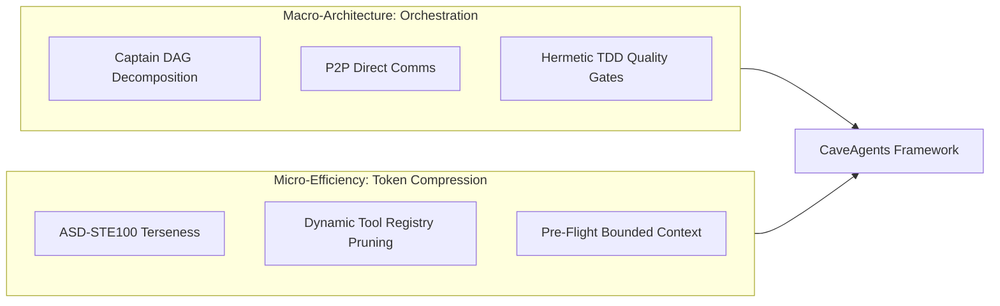

# Inspiration

## Origin Story

Multi-agent architectures promised modular problem decomposition, parallel task execution, and specialized domain expertise. In practice, however, early multi-agent frameworks suffered from a devastating limitation: **The Multi-Agent Token Tax**.

In real-world benchmarks, executing a moderate software refactor or feature implementation using popular multi-agent orchestration frameworks (such as Teamwork or unconstrained AgentTeams) routinely incurred a **5x to 7x token penalty** compared to a single monolithic agent solving the exact same task.

```
Monolithic Standard Agent:     ~30,000 tokens
Typical Multi-Agent System:   ~155,000 - 208,000 tokens  (5x - 7x penalty!)
```

This token explosion was driven by three compounding structural inefficiencies:
1. **Tool Schema Inflation**: Every subagent carries full JSON Schema definitions for every system tool on every single turn (~2,500 tokens of boilerplate per step).
2. **Conversational Chaff**: Subagents waste hundreds of tokens per turn on polite greetings, self-narration ("I will now check file X"), hedging, and conversational pleasantries.
3. **Redundant Context Window Duplication**: Re-sharing the entire workspace state, file trees, and execution history across every subagent context window.

---

## Caveman Mode

The antidote to conversational bloat emerged from **Caveman Mode**—an ultra-terse prompt constraint inspired by Simplified Technical English (**ASD-STE100**). In Caveman mode:
- All filler words, conversational greetings, and pleasantries are eliminated.
- Tool narration ("Now I am going to view the file...") is strictly prohibited.
- Syntax is condensed to telegraphic, factual statements, structured key-value payloads, and direct imperative tool invocations.

When applied to a single monolithic agent, Caveman compression reduced token consumption from **30,241 tokens** to **16,285 tokens** (-46.1%) while maintaining identical code accuracy and test pass rates.

However, a single monolithic agent is inherently bounded: it cannot execute tasks in parallel, isolate failure modes, or decompose complex multi-module systems across independent context boundaries.

---

## Putting It Together

CaveAgents was born from a fundamental synthesis:
- **Macro-Architecture**: Robust Directed Acyclic Graph (DAG) task orchestration, parallel subagent execution, and automated TDD quality gates (derived from systems like AgentTeams).
- **Micro-Efficiency**: Extreme prompt terseness (Caveman / ASD-STE100) and aggressive runtime tool schema pruning.



By removing the 5x–7x multi-agent penalty and pruning tool schemas dynamically, CaveAgents unlocks the **Inverted Cost Frontier**—enabling multi-agent parallel systems to run at a lower token cost than even a standard single-agent session.
