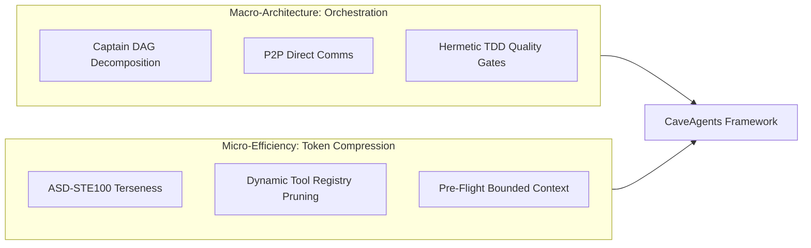

# Inspiration

## Origin Story

Multi-agent architectures promised modular problem decomposition, parallel task execution, and specialized domain expertise. In practice, however, early multi-agent frameworks suffered from a devastating limitation: **The Multi-Agent Token Tax**.

In benchmark evaluations on software feature implementation, executing with unconstrained multi-agent orchestration frameworks (such as Standard Teamwork or AgentTeams) incurred a heavy token penalty compared to single-agent execution:

```
Pruned Monolith Control:       ~11,400 tokens (1.00x baseline)
Standard Monolith Baseline:    ~30,000 tokens (2.66x baseline)
Standard Multi-Agent Systems:  ~143,000 - 155,000 tokens (12.6x - 13.6x baseline)
```

This token explosion was driven by three compounding structural inefficiencies:
1. **Tool Schema Inflation**: Every subagent carries full JSON Schema definitions for every system tool on every single turn (~2,500 tokens of boilerplate per step).
2. **Conversational Chaff**: Subagents waste hundreds of tokens per turn on polite greetings, self-narration ("I will now check file X"), hedging, and conversational pleasantries.
3. **Redundant Context Window Duplication**: Re-sharing the entire workspace state, file trees, and execution history across every subagent context window.

---

## Caveman Mode

The antidote to conversational bloat emerged from **Caveman Mode**, created by **[Julius Brussee](https://github.com/JuliusBrussee/caveman)** (*"why use many token when few token do trick"*) and inspired by Simplified Technical English (**ASD-STE100**). In Caveman mode:
- All filler words, conversational greetings, and pleasantries are eliminated.
- Tool narration ("Now I am going to view the file...") is strictly prohibited.
- Syntax is condensed to telegraphic, factual statements, structured key-value payloads, and direct imperative tool invocations.

When applied to a single monolithic agent, Caveman compression reduced token consumption from **30,241 tokens** to **16,285 tokens** (-46.1%) while maintaining identical code accuracy and test pass rates.

However, a single monolithic agent is inherently bounded: it cannot execute tasks in parallel, isolate failure modes, or decompose complex multi-module systems across independent context boundaries.

---

## Putting It Together

CaveAgents was born from a fundamental synthesis:
- **Macro-Architecture**: Robust Directed Acyclic Graph (DAG) task orchestration, parallel subagent execution, and automated TDD quality gates (derived from systems like AgentTeams).
- **Micro-Efficiency**: Extreme prompt terseness (Caveman / ASD-STE100) and aggressive runtime tool schema pruning.



By eliminating conversational chatter, bounding task context, and dynamically pruning unused tool schemas, CaveAgents cuts multi-agent overhead by 81.3% (from 143k tokens down to 26.8k tokens), bringing a 3-agent TDD team significantly closer to single-agent efficiency.
