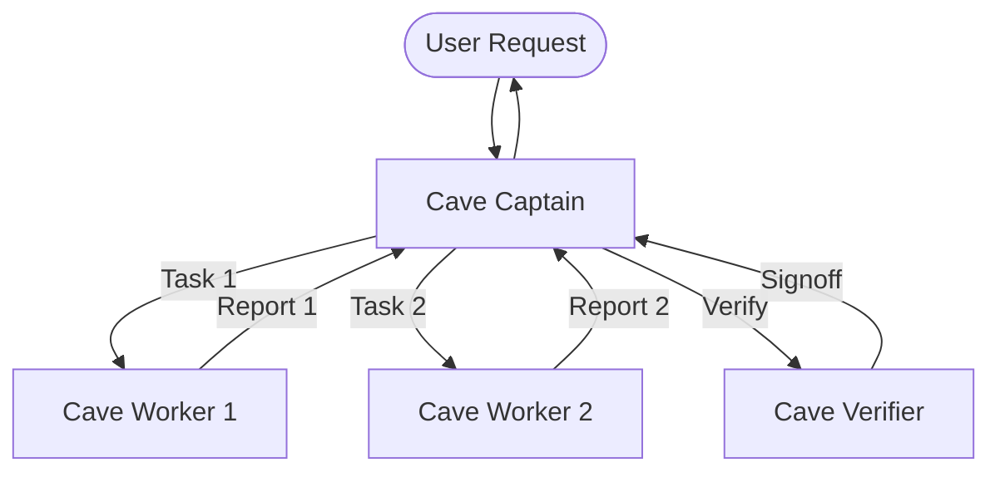

# CaveAgents v1: Serial Pipeline Architecture

`CAVEAGENTS_V1` represents the foundational proof-of-concept combining Caveman terse prompting with sequential agent orchestration.

---

## Architecture Overview

In v1, execution followed a strict centralized serial pipeline:

## Characteristics

1. **Centralized Routing**: All inter-agent data passed through the Captain. No peer-to-peer communication was permitted.
2. **Serial Phasing**: Subagents were spawned one at a time. Worker 2 could not commence until Worker 1 completed and reported back to Captain.
3. **Caveman Terseness**: Subagents adopted ASD-STE100 simplified English (omitting articles, conversational pleasantries, and tool narration).
4. **Token Footprint**: 109,984 tokens on standard refactor benchmark (down from 208,555 tokens in Teamwork baseline, a 47.3% reduction).

## Limitations

- **Captain Context Bloat**: Relaying intermediate reports through Captain bloated the Captain's context window.
- **Latency Inefficiency**: Serial sequencing caused total wall-clock time to scale linearly with the sum of all task steps.
- **Tool Duplication**: All spawned subagents inherited the entire default tool registry.
