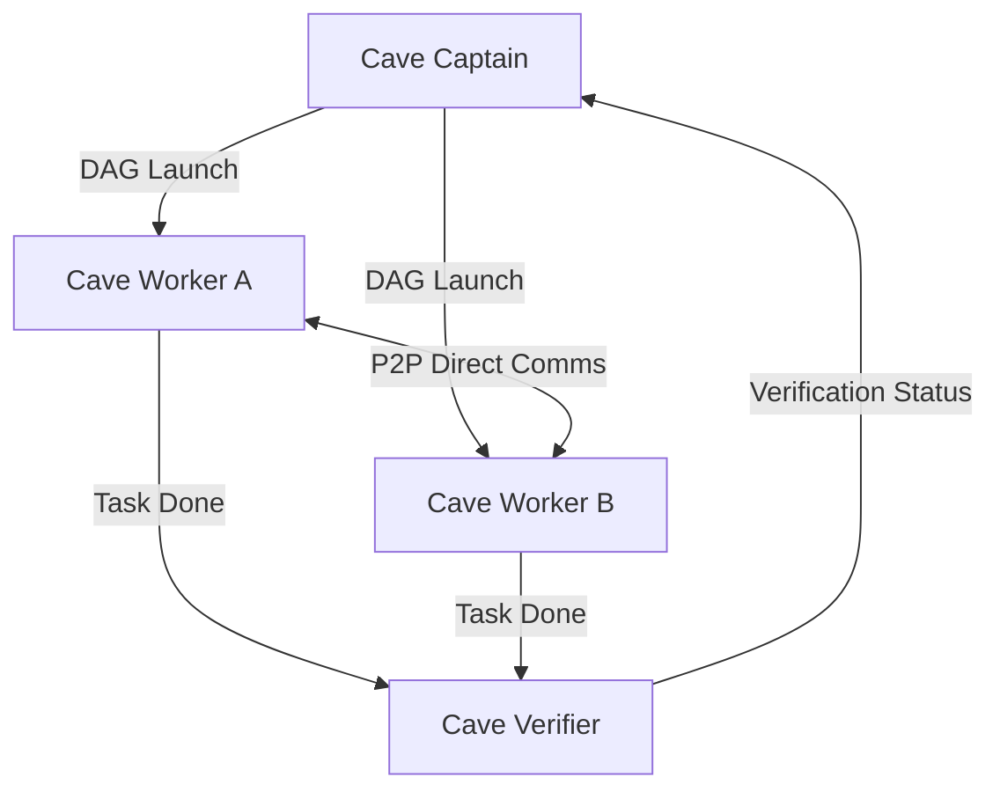

# CaveAgents v2: Clones & Peer-to-Peer Direct Communication

`CAVEAGENTS_V2` eliminated the centralized relay bottleneck by enabling peer-to-peer (P2P) messaging between active workers and launching parallel clones.

---

## Architecture Overview

## Key Innovations

1. **P2P Direct Comms**: Workers exchange interface definitions, types, and schema dependencies directly via `send_message(Recipient=worker_id)`, bypassing Captain's context.
2. **Parallel Agent Clones**: Independent sub-modules execute concurrently across isolated context windows.
3. **Terse Wire Serialization**: Messages use structured JSON wire payloads with action tags (`TASK`, `HANDOFF`, `RESULT`, `SYNC`).
4. **Token Footprint**: 91,432 tokens on standard refactor benchmark (56.2% reduction vs Teamwork baseline).

## Limitations

- **Pre-Flight Context Uncertainty**: Agents still received full workspace context dumps during initial prompt generation.
- **Unpruned Tool Registries**: Subagents inherited unneeded tools (e.g. image generation, browser rendering), carrying substantial declaration schema overhead.
