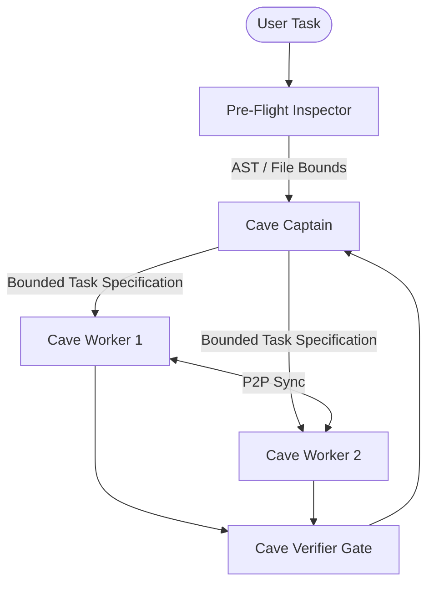

# CaveAgents v3: Pre-Flight Bound Architecture

`CAVEAGENTS_V3` introduced bounded pre-flight inspection, eliminating blind workspace dumps and confining agent context strictly to task-relevant surfaces.

---

## Architecture Overview

## Key Innovations

1. **Pre-Flight Bound Analysis**: Before worker dispatch, the Captain or Pre-Flight inspector scans file trees, AST dependencies, and git diffs, formulating an explicit `inScope` boundary.
2. **Elimination of Context Hallucinations**: Workers receive only explicit file paths, precise line numbers, and strict interface contracts.
3. **Compound Verification**: Test executions run in hermetic sandboxes with immediate short-circuiting on the first failing assertion.
4. **Token Footprint**: 50,395 tokens on TokenBucket task (64.8% reduction vs Teamwork Live baseline at 143,219 tokens).

## Remaining Bottleneck

- While prompts and message exchanges were minimized, subagents still carried the full tool definition catalog in every single prompt step (approximately 2,500 tokens of schema declarations per invocation).
