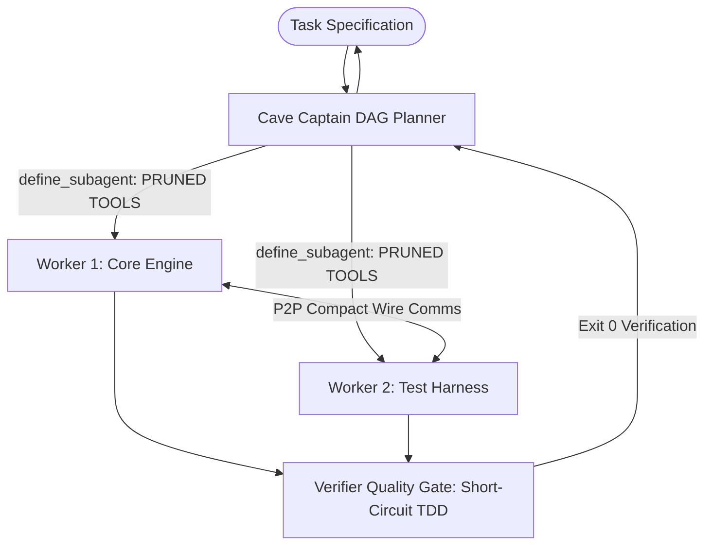

# CaveAgents v4: Dynamic Tool Registry Pruning & Bounded TDD

`CAVEAGENTS_V4` minimizes multi-agent overhead through dynamic tool schema pruning, strict context scoping, and direct peer-to-peer messaging—reducing multi-agent token expenditure by 81.3% compared to standard teamwork (26,784 vs 143,219 tokens).

---

## Architecture Overview

## Core Mechanisms

### 1. Dynamic Tool Registry Pruning
In standard agent frameworks, every step of an agent invocation injects JSON Schema definitions for every registered tool (the default Antigravity environment registers 16 tools, totaling ~2,480 tokens per step).
In v4, subagents are dynamically instantiated with only the exact tools required for their role:
- Workers receive only `run_command`, `write_to_file`, `replace_file_content`, `view_file`, and `send_message`.
- Omitted: `generate_image`, `notebook_edit`, `read_url_content`, `search_web`, `schedule`, `manage_task`, etc.
- **Direct Impact**: Reduces per-turn tool schema overhead from ~2,480 down to ~380 tokens, saving ~2,100 tokens on every single step turn across all subagents.

### 2. Autonomous Local Inspection
Subagents perform targeted inspection of precise files and symbols rather than loading large context payloads into the initial prompt.

### 3. Compound Verification & Early Exit
Tests are structured with fast failing assertions (`--tb=short`, `-q`), avoiding lengthy error traceback generation in the context window.

### 4. Multi-Agent Optimization vs. Single-Agent Control
Multi-agent coordination introduces substantial token overhead compared to single-agent execution: in our benchmark, standard teamwork incurred 12.58x the token cost of a pruned single-agent control. CaveAgents v4 significantly reduces this multi-agent overhead:
- Standard Teamwork (Live 3-Agent Run, 16 Tools): **143,219 tokens** (12.58x Control)
- CaveAgents v4 Multi-Agent (Live 3-Agent Sequential TDD Run, 5 Tools): **26,784 tokens** (2.35x Control; 81.3% reduction vs Standard Teamwork)
- Standard Monolith (Verbose Baseline, 16 Tools): **30,241 tokens** (2.66x Control)
- Caveman Monolith (Terse Baseline, 16 Tools): **16,285 tokens** (1.43x Control)
- Pruned Monolith Control (Terse Control, 5 Tools): **11,381 tokens** (1.00x Control Baseline)

> **Key Takeaway**: The apparent "Inverted Cost Frontier" vs Standard Mono was an artifact of a verbose, unpruned baseline: Standard Mono was burdened by both a verbose prompt and 16 unused tools. Caveman Mono (which also carried all 16 tools) already completed the task in 16,285 tokens (1.43x of control), and the 5-tool Pruned Monolith Control completed it in 11,381 tokens (1.00x, 2.35x cheaper than v4). On micro-tasks, single agents pay zero handoff or supervisor coordination overhead.
